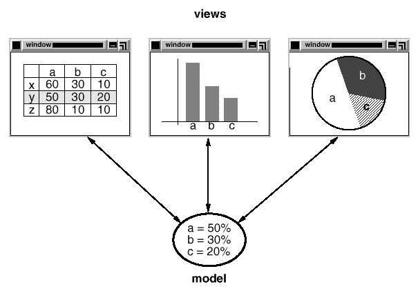

# 1.2 스몰토크 MVC를 사용한 디자인 패턴
스몰토크에서는 사용자 인터페이스를 만드는 데 MVC(Model/View/Controller)의 세가지 클래스를 사용하곤 합니다. MVC가 갖는 디자인 패턴을 살펴보면 여러분이 "패턴"이라는 말의 의미를 이해하는 데 도움이 될 것입니다.

MVC는 세 가지 객체로 구성되어 있습니다. 모델(Model)은 응용프로그램 객체이고, 뷰(View)는 스크린에 모델을 디스플레이하는 방법이며, 컨트롤러(Controller)는 사용자 인터페이스가 사용자 입력에 반응하는 방법을 정의합니다. MVC를 사용하기 전에는 사용자 인터페이스 설계가 이러한 객체들을 모두 묶어서 하나의 객체로 처리하였습니다. 유연성과 재사용성의 증대를 위해서 MVC는 이들 간의 결합도를 없앱니다.

MVC는 뷰와 모델 간에 등록/통지(subscribe/notify) 프로토콜을 만들어 종속성을 없앱니다. 뷰는 그 외형이 반드시 모델의 상태를 반영하도록 보장해야 합니다. 모델의 데이터가 변경될 때마다 모델은 자신과 관련된 뷰에 알려주고, 이 통보에 따라서 각 뷰는 스스로 자신의 외형을 변경해야 합니다. 이것이 제대로 될 경우, 하나의 모델에 여러 뷰를 첨부하면 한 가지 모델에 대한 여러 가지 표현을 지원할 수 있습니다. 또한 모델을 수정할 필요없이 모델에 대해서 새로운 뷰를 생성할 수도 있습니다.

위 그림을 봐 주세요. 한 개의 모델과 이 모델을 표현하는 세 가지 뷰를 보여줍니다(간단히 하기 위해서 컨트롤러는 생략하였습니다). 이 모델은 몇몇 데이터 값을 정의하고 있으며, 뷰는 스프레드시트, 히스토그램, 파이 차트처럼 다양한 방식으로 데이터를 표현합니다. 이 모델은 값이 변할 때마다 뷰에게 알려주고, 뷰들은 값을 표현하고 조작하기 위해 모델과 교류합니다.

겉모양 그대로만 보면, 이 그림은 그냥 모델에서 뷰를 떼어내는 설계의 한 예입니다. 그러나 이 설계 방법은 더 일반적인 문제에도 적용이 가능합니다. 즉, 한 객체에서 일어난 변경을 다른 객체들에 반영하도록 별도의 객체를 둠으로써, 변경이 일어난 객체는 변경 반영이 필요한 다른 객체들을 알 필요가 없게끔 객체를 분리하는 거죠. 이런 설계를 일반화한 것이 [5.7 감시자(Observer)](https://github.com/wonder13662/my-books/blob/writing/GOF-design-patterns/Chapter05/5-7.md) 패턴입니다.

MVC의 다른 특징으로는 뷰를 중첩시킬 수 있다는 것입니다. 예를 들어, 버튼의 제어판(control panel)은 여러 개의 버튼을 포함하는 복잡한 뷰로 구현할 수 있습니다. MVC는 CompositeView 클래스를 이용하여 중첩된 뷰를 지원하고, 또한 CompositeView 클래스는 View 클래스의 서브클래스이므로 CompositeView 객체를 View 객체처럼 다룰 수 있습니다. 즉, CompositeView 객체는 View 객체가 사용되는 곳이면 동일하게 사용될 수 있습니다.

이는 복합 뷰를 마치 하나의 단일 뷰와 동일한 것처럼 사용하려는 설계 개념입니다. 이 설계 역시 일반적인 문제에 적용이 가능합니다. 일반적으로 단일 객체처럼 복합 설계를 사용하고 싶을 때가 많은데, 이런 일반적인 설계를 담는 것이 [4.3 복합체(Composite)](https://github.com/wonder13662/my-books/blob/writing/GOF-design-patterns/Chapter04/4-3.md) 패턴 입니다.

MVC는 시각적 표현 방법의 변경 없이 사용자 입력에 대한 뷰의 반응 방법을 변경할 수 있습니다. 명령 키 대신 팝업 메뉴를 사용할 수도 있고 키보드를 이용하도록 변경할 수도 있습니다. MVC에서는 Controller 객체를 이용하여 반응 방법을 캡슐화합니다. 컨트롤러의 클래스 계층을 통해서 기존 방식과 다른 방식을 새로운 컨트롤러로 정의하게 하는 것입니다.

특정 대응 전략을 구현하기 위해 View 클래스가 Controller 서브클래스의 인스턴스를 사용한다면, 다른 전략을 구현하기 위해 현재의 컨트롤러 인스턴스를 다른 종류의 컨트롤러 인스턴스로 대체만 하면 됩니다. 이런 방식을 이용하면 프로그램 실행 중에도 사용자 입력에 대응하는 뷰의 방식을 변경할 수 있습니다. 뷰가 제거되어 입력을 수용하지 못하도록 하려면, 사용자 이벤트를 무시하는 컨트롤러를 제공하면 됩니다.

뷰와 컨트롤러의 관계는 [5.9 전략(Strategy)](https://github.com/wonder13662/my-books/blob/writing/GOF-design-patterns/Chapter05/5-9.md) 패턴의 한 예입니다. [5.9 전략(Strategy)](https://github.com/wonder13662/my-books/blob/writing/GOF-design-patterns/Chapter05/5-9.md) 패턴은 알고리즘을 표현하는 객체로 정적 또는 동적으로 알고리즘을 대체하고자 할 때 매우 유용한 방식입니다. 또한 다양한 알고리즘의 변형이 가능하거나, 알고리즘이 캡슐화해야 할 데이터 구조가 복잡할 때 유용한 방식이기도 합니다.

MVC는 이외에 다른 패턴도 씁니다. 팩토리 메서드 패턴을 이용해서 뷰에 대한 기본 컨트롤러 클래스를 지정한다든지, 장식자 패턴을 이용해서 뷰에 스크롤을 추가한다든지 하는 것 말이죠. 그러나 MVC에서 뷰와 컨트롤러 관계를 맺어주는 데 주로 쓰이는 패턴은 [5.7 감시자(Observer)](https://github.com/wonder13662/my-books/blob/writing/GOF-design-patterns/Chapter05/5-7.md), [4.3 복합체(Composite)](https://github.com/wonder13662/my-books/blob/writing/GOF-design-patterns/Chapter04/4-3.md), [5.9 전략(Strategy)](https://github.com/wonder13662/my-books/blob/writing/GOF-design-patterns/Chapter05/5-9.md) 패턴입니다.