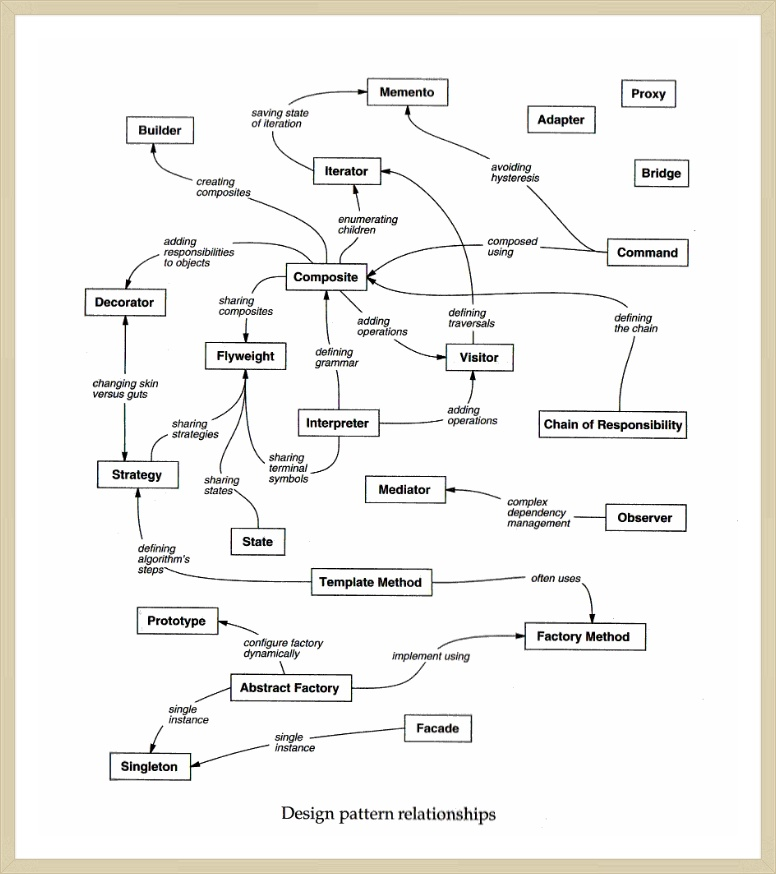

# 1.5 카탈로그 조직화하기
이 책에 등장하는 디자인 패턴은 저마다 추상화 수준과 입도(粒度:암석이나 퇴적물을 구성하는 광물 입자의 평균 크기)가 천차만별입니다. 게다가, 그 수효가 23개나 되기 때문에, 이들을 조직화하지 않으면 안 될 것 같더군요. 이 절에서는 디자인 패턴을 분류하여 관련된 패턴들을 하나의 군으로 묶고자 합니다. 이렇게 분류되어 있으면 패턴을 더 빨리 배우는 데 도움이 될 뿐만 아니라 새로운 패턴을 찾아내는 방법도 빨리 깨우칠 수 있게 됩니다.

패턴을 분류하는 기준은 두 가지입니다. 첫 번째 분류 기준은 **목적(purpose)**인데요, 다시 말해 패턴이 무엇을 하는지 정의하는 것입니다. 패턴은 **생성**, **구조**, **행동** 중의 한가지 목적을 갖습니다. **생성**, 패턴은 객체의 생성 과정에 관여하는 것이고, **구조** 패턴은 클래스나 객체의 합성에 관한 패턴들입니다. **행동** 패턴은 클래스나 객체들이 상호작용하는 방법과 책임을 분산하는 방법을 정의합니다.

## 표 1.1
||목적:생성|목적:구조|목적:행동|
|---|---|---|---|
|범위:클래스|[3.3 팩토리 메서드(Factory Method)](https://github.com/wonder13662/my-books/blob/writing/GOF-design-patterns/Chapter03/3-3.md)|[4.1 적응자(Adapter)](https://github.com/wonder13662/my-books/blob/writing/GOF-design-patterns/Chapter04/4-1.md)|[5.3 해석자(Interpreter)](https://github.com/wonder13662/my-books/blob/writing/GOF-design-patterns/Chapter05/5-3.md) [5.10 템플릿 메서드(Template Method)](https://github.com/wonder13662/my-books/blob/writing/GOF-design-patterns/Chapter05/5-10.md)|
|범위:객체|[3.1 추상 팩토리(Abstract Factory)](https://github.com/wonder13662/my-books/blob/writing/GOF-design-patterns/Chapter03/3-1.md) [3.2 빌더(Builder)](https://github.com/wonder13662/my-books/blob/writing/GOF-design-patterns/Chapter03/3-2.md) [3.4 원형(Prototype)](https://github.com/wonder13662/my-books/blob/writing/GOF-design-patterns/Chapter03/3-4.md) [3.5 단일체(Sigleton)](https://github.com/wonder13662/my-books/blob/writing/GOF-design-patterns/Chapter03/3-5.md)|[4.1 적응자(Adapter)](https://github.com/wonder13662/my-books/blob/writing/GOF-design-patterns/Chapter04/4-1.md) [4.2 가교(Bridge)](https://github.com/wonder13662/my-books/blob/writing/GOF-design-patterns/Chapter04/4-2.md) [4.3 복합체(Composite)](https://github.com/wonder13662/my-books/blob/writing/GOF-design-patterns/Chapter04/4-3.md) [4.4 장식자(Decorator)](https://github.com/wonder13662/my-books/blob/writing/GOF-design-patterns/Chapter04/4-4.md) [4.5 퍼사드(Facade)](https://github.com/wonder13662/my-books/blob/writing/GOF-design-patterns/Chapter04/4-5.md) [4.6 플라이급(Flyweight)](https://github.com/wonder13662/my-books/blob/writing/GOF-design-patterns/Chapter04/4-6.md) [4.7 프록시(Proxy)](https://github.com/wonder13662/my-books/blob/writing/GOF-design-patterns/Chapter04/4-7.md)|[5.1 책임 연쇄(Chain of Responsibility)](https://github.com/wonder13662/my-books/blob/writing/GOF-design-patterns/Chapter05/5-1.md) [5.2 명령(Command)](https://github.com/wonder13662/my-books/blob/writing/GOF-design-patterns/Chapter05/5-2.md) [5.3 해석자(Interpreter)](https://github.com/wonder13662/my-books/blob/writing/GOF-design-patterns/Chapter05/5-3.md) [5.5 중재자(Mediator)](https://github.com/wonder13662/my-books/blob/writing/GOF-design-patterns/Chapter05/5-5.md) [5.6 메멘토(Memento)](https://github.com/wonder13662/my-books/blob/writing/GOF-design-patterns/Chapter05/5-6.md) [5.7 감시자(Observer)](https://github.com/wonder13662/my-books/blob/writing/GOF-design-patterns/Chapter05/5-7.md) [5.8 상태(State)](https://github.com/wonder13662/my-books/blob/writing/GOF-design-patterns/Chapter05/5-8.md) [5.9 전략(Strategy)](https://github.com/wonder13662/my-books/blob/writing/GOF-design-patterns/Chapter05/5-9.md) [5.11 방문자(Visitor)](https://github.com/wonder13662/my-books/blob/writing/GOF-design-patterns/Chapter05/5-11.md)|

두 번째 분류 기준은 **범위(scope)**입니다. 패턴을 주로 클래스에 적용하는지 아니면 객체에 적용하는지를 구분하는 것입니다. 클래스 패턴은 클래스와 서브클래스 간의 관련성을 다루는 패턴입니다. 관련성은 주로 상속이며, 컴파일 타임에 정적으로 결정됩니다. 객체 패턴은 객체 관련성을 다루는 패턴으로서, 런타임에 변경할 수 있으며 더 동적인 성격을 가집니다. 대부분의 패턴들은 어느 정도 상속을 이용합니다. 클래스 패턴으로 정의한 패턴만 클래스 관련성을 이용하는데, 표 1.1에서처럼 일부만 클래스 패턴이고, 대부분 패턴은 객체 영역에 속하는 것임을 주목합시다.

생성(creational) "클래스" 패턴은 객체를 생성하는 책임의 일부를 서브클래스가 담당하도록 넘깁니다. 그러나 생성 "객체" 패턴은 이를 다른 객체에게 위임합니다. 구조(structual) "클래스" 패턴은 상속을 이용해서 클래스를 복합하고, 구조 "객체" 패턴은 객체를 합성하는 방법을 정의합니다. 행동(behavioral) "클래스" 패턴은 상속을 이용해서 알고리즘과 제어 흐름을 기술하고, 행동 "객체" 패턴은 하나의 작업을 수행하기 위해 객체 집합이 어떻게 협력하는지를 기술합니다.

패턴을 조직하는 또 다른 방법도 있습니다. 일부 패턴은 함께 사용해야 할 때도 있는데, 예를 들어 [4.3 복합체(Composite)](https://github.com/wonder13662/my-books/blob/writing/GOF-design-patterns/Chapter04/4-3.md) 패턴은 [5.4 반복자(Iterator)](https://github.com/wonder13662/my-books/blob/writing/GOF-design-patterns/Chapter05/5-4.md) 패턴과 [5.11 방문자(Visitor)](https://github.com/wonder13662/my-books/blob/writing/GOF-design-patterns/Chapter05/5-11.md) 패턴을 함께 사용해야 할 때가 많습니다. 또 어떤 패턴은 다른 패턴의 대안이 되기도 합니다. [3.4 원형(Prototype)](https://github.com/wonder13662/my-books/blob/writing/GOF-design-patterns/Chapter03/3-4.md) 패턴은 [3.1 추상 팩토리(Abstract Factory)](https://github.com/wonder13662/my-books/blob/writing/GOF-design-patterns/Chapter03/3-1.md) 패턴의 대안 패턴입니다. 또, 패턴 간의 의도는 서로 다르지만 결과적으로 유사한 설계 구조를 만드는 패턴도 있습니다. [4.3 복합체(Composite)](https://github.com/wonder13662/my-books/blob/writing/GOF-design-patterns/Chapter04/4-3.md) 패턴과 [4.4 장식자(Decorator)](https://github.com/wonder13662/my-books/blob/writing/GOF-design-patterns/Chapter04/4-4.md) 패턴의 의도는 다르지만 구조는 매우 비슷합니다.

## 그림 1.1

디자인 패턴을 조직하는 방법은 이외에 한 가지가 더 있습니다. 그림 1.1에 정의한 것처럼 패턴 간의 참조 관계에 따라 관리하는 것입니다. 이는 패턴마다 기술한 "관련 패턴"의 참조 관계를 표현한 것입니다. 디자인 패턴을 조직할 수 있는 방법은 다양합니다. 패턴을 다양한 각도로 생각해보면, 패턴이 무엇을 하고, 패턴들을 어떻게 비교할 것이며, 언제 적용할 것인가에 대한 여러분의 인식이 점점 좋아질 것입니다.

