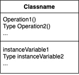
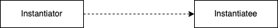
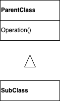
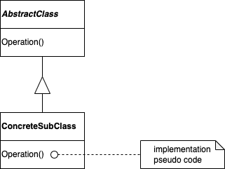
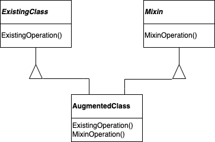

# 1.6 디자인 패턴을 이용하여 문제를 푸는 방법
디자인 패턴은 객체지향 설계자들이 매일 부딪히게 되는 많은 문제를 다양한 방법으로 해결해 줍니다. 여기서는 이 문제 중 몇 가지를 제시해 보았습니다. 이 문제에 대해 디자인 패턴이 어떤 해결책을 가져가는지를 살펴보도록 합시다.
## 적당한 객체 찾기
객체지향 프로그램은 **객체(object)** 로 만듭니다. 객체는 이 데이터에 연산을 가하는 프로시저(procedure)를 함께 묶은 단위입니다. 프로시저를 일반적으로 **메서드(method)** 또는 **연산(operation)** 이라고 합니다. 객체는 **요청(request)** 또는 **메시지(message)** 를 사용자에게 받으면 연산을 수행합니다.

요청은 객체가 연산을 실행하게 하는 유일한 방법이고, 연산은 객체의 내부 데이터의 상태를 변경하는 유일한 방법입니다. 이러한 접근의 제약 사항으로 객체의 내부 상태는 **캡슐화(encapsulate)** 된다고 말합니다. 객체 외부에서는 객체의 내부 데이터에 직접 접근할 수 없고, 객체의 내부 데이터 표현 방법(데이터 타입 등)을 알 수 없습니다.

객체지향 설계의 가장 어려운 부분은 시스템을 구성할 객체의 분할을 결정하는 것입니다. 여러 요인을 고려해야 하기 때문에 매우 어려운 작업입니다. 고려해야 할 요인에는 캡슐화, 크기 정하기, 종속성, 유연성, 성능, 진화, 재사용성 등이 있습니다. 이 모두를 어떻게 고려하는가에 따라 서로 다른 방법으로 분할이 가능합니다.

이 문제에 대해 객체지향 설계 방법론들은 서로 다른 방법으로 접근합니다. 문제 기술서를 작성하고 명사와 동사를 추출해서 각각을 클래스와 연산으로 만드는 방법도 있습니다. 시스템의 협력 관계나 책임성을 중심으로 설계하는 방법도 있고, 실세계를 모델로 만들고 이를 분석해 설계로 전이하는 과정에서 객체로 바꾸는 방법을 사용할 수도 있습니다. 그러나 어느 방법이 가장 좋은 방법이라고 말할 수는 없습니다.

설계 단계의 객체 대부분은 분석 모델에서부터 만들어진 것입니다. 그러나 객체지향 설계는 실세계와 대응 관계를 갖지 못할 때가 많습니다. 즉, 분석 모델의 객체는 실세계 객체들이지만, 설계 모델의 객체에는 배열, 리스트처럼 구현에 가까운 클래스들도 있습니다. 어떤 설계 클래스들은 높은 수준의 추상화를 보일 수도 있는데, 예를 들어 [4.3 복합체(Composite)](https://github.com/wonder13662/my-books/blob/writing/GOF-design-patterns/Chapter04/4-3.md) 패턴은 분석 모델과 물리적 대응 관계를 갖지는 않지만, 객체들을 동일하게 다루게 해주는 새로운 추상적 개념입니다. 실세계를 그대로 반영하는 모델링만 강조하면 현재의 실세계는 반영할 수 있지만 미래의 실세계는 반영할 수 없습니다. 설계 단계 동안 만들어야 하는 새로운 추상화는 설계의 유연성을 증진하기 위한 중요한 노력 중 하나입니다.

디자인 패턴은 여러분이 덜 명확한 추상적 개념과 이것을 잡아낸 객체를 알아보는 데에 도움을 줍니다. 처음 객체지향 프로그래밍을 하는 개발자들에게 어떤 공정이나 알고리즘을 객체로 꾸미는 것은 자연스러운 일이 아닙니다. 그러나 유연한 설계를 만드는 데는 반드시 필요한 일이기도 하죠. [5.9 전략(Strategy)](https://github.com/wonder13662/my-books/blob/writing/GOF-design-patterns/Chapter05/5-9.md) 패턴은 상호교환이 가능한 알고리즘군을 어떻게 구현할지 설명합니다. [5.8 상태(State)](https://github.com/wonder13662/my-books/blob/writing/GOF-design-patterns/Chapter05/5-8.md) 패턴은 대상들의 각 상태를 객체로 표현합니다. 이 상태 객체들은 분석 단계에서는 거의 식별하기 어려우며, 설계의 초기 단계에서조차 찾아내기가 쉽지 않습니다. 이 객체는 이후에 설계를 좀 더 유연하고 재사용이 가능한 것으로 만들려는 과정을 통해서 천천히 모습을 드러냅니다.
## 객체의 크기 결정
객체는 크기나 개수가 딱 정해져 있지 않습니다. 하드웨어 하나하나를 모두 객체로 표현할 수도 있지만, 응용프로그램 전체를 하나의 객체로 만들 수도 있습니다. 적당한 객체의 규모는 어떻게 결정할 수 있을까요?

디자인 패턴에서 이 문제의 답을 얻을 수 있습니다. [4.5 퍼사드(Facade)](https://github.com/wonder13662/my-books/blob/writing/GOF-design-patterns/Chapter04/4-5.md) 패턴은 서브시스템을 어떻게 객체로 표현할 수 있을지 설명하고, [4.6 플라이급(Flyweight)](https://github.com/wonder13662/my-books/blob/writing/GOF-design-patterns/Chapter04/4-6.md) 패턴은 규모는 작지만 개수는 많은 객체를 다루는 방법을 설명합니다. 또 어떤 패턴들은 객체를 좀 더 작은 규모의 객체로 분할하는 구체적인 방법을 다루기도 합니다. [3.1 추상 팩토리(Abstract Factory)](https://github.com/wonder13662/my-books/blob/writing/GOF-design-patterns/Chapter03/3-1.md) 패턴과 [3.2 빌더(Builder)](https://github.com/wonder13662/my-books/blob/writing/GOF-design-patterns/Chapter03/3-2.md) 패턴은 다른 객체를 생성하는 책임만 있는 객체를 만들어 냅니다. [5.11 방문자(Visitor)](https://github.com/wonder13662/my-books/blob/writing/GOF-design-patterns/Chapter05/5-11.md) 패턴과 [5.2 명령(Command)](https://github.com/wonder13662/my-books/blob/writing/GOF-design-patterns/Chapter05/5-2.md) 패턴은 요청을 자신이 처리하는 것이 아니라, 다른 객체나 객체 집합이 요청을 처리하여 구현하도록 책임지는 객체를 만들어 냅니다.
## 객체 인터페이스의 명세
객체가 선언하는 모든 연산은 연산의 이름, 매개변수로 받아들이는 객체들, 연산의 반환 값을 명세합니다. 이를 연산의 **시그너처(signature)** 라고 합니다. **인터페이스(interface)** 는 객체가 정의하는 연산의 모든 시그너처들을 일컫는 말로 객체의 인터페이스는 객체가 받아서 처리할 수 있는 연산의 집합입니다. 객체 인터페이스의 정의된 시그처너와 일치하는 어떤 요청이 객체에 전달되면, 객체는 연산을 수행하여 그 요청을 처리합니다.

**타입(type)** 은 특정 인터페이스를 나타낼 때 사용하는 이름입니다. 객체가 "Window" 타입을 갖는다는 것은 "Window" 인터페이스에 정의한 연산들을 모두 처리할 수 있다는 것을 의미합니다. 객체는 여러 타입을 가질 수 있고, 서로 다른 객체가 하나의 타입을 공유할 수도 있습니다. 객체의 인터페이스에 정의된 연산들 중 일부는 A 타입이 정의하는 연산이고, 다른 일부는 B 타입이 정의한 연산일 수 있습니다. 같은 타입의 두 객체는 인터페이스의 일부를 공유해야 합니다. 인터페이스가 다른 인터페이스를 부분집합으로 포함할 때도 있는데, 다른 인터페이스를 포함하는 인터페이스를 **서브타입(subtype)** 이라고 하고, 다른 인터페이스가 포함하는 인터페이스를 **슈퍼타입(supertype)** 이라고 합니다. **서브타입(subtype)** 은 **슈퍼타입(supertype)** 의 인터페이스를 상속한다고 이야기합니다. **서브타입(subtype)** 이 **슈퍼타입(supertype)** 을 상속하면, **서브타입(subtype)** 은 **슈퍼타입(supertype)** 에 정의된 연산을 포함하게 됩니다.

인터페이스 개념은 객체지향 시스템에서 가장 기본적인 것입니다. 객체는 인터페이스로 자신을 드러냅니다. 외부에서 객체를 알 수 있는 방법은 인터페이스 밖에 없기 때문에 인터페이스를 통해서만 처리를 요청할 수 있습니다. 객체의 인터페이스는 구현에 대해서는 전혀 알려주지 않습니다. 그러므로 서로 다른 객체는 인터페이스에 정의한 요청의 구현 방법을 자유롭게 선택할 수 있습니다. 이 의미는 동일한 인터페이스를 갖는 두 객체가 완전히 다른 구현을 가질 수 있다는 것입니다.

그러므로 객체에 요청이 전달되면, 요청과 이를 받는 객체에 따라서 수행되는 처리 방식이 달라집니다. 동일한 요청이라도 처리하는 객체들이 다른 객체라면, 이 요청에 대한 구현을 어떻게 했는가에 따라서 다른 결과가 나올 수 있습니다. 어떤 요청과 그 요청을 처리할 객체를 프로그램 실행 중, 즉 런타임에 연결 짓는 것을 **동적 바인딩(dynamic binding)** 이라고 합니다. 

**동적 바인딩(dynamic binding)** 은 요청이 어떻게 구현되어 어떤 결과를 만들어 낼지를 런타임에 결정할 수 있음을 의미합니다. 즉, 프로그램을 작성할 때 객체가 어떤 특정 인터페이스를 갖도록 작성하며, 이 객체는 요청을 처리할 정확한 인터페이스를 갖고 있습니다. 또한 **동적 바인딩(dynamic binding)** 은 프로그램이 기대하는 객체를 동일한 인터페이스를 갖는 다른 객체로 대체할 수 있게 해 줍니다. 이런 대체성을 우리는 **다형성(polymorphism)** 이라고 하는데, 이는 객체지향 시스템의 핵심 개념입니다. **다형성(polymorphism)** 은 사용자의 정의를 단순화하고 객체 간의 결합도를 없애며, 프로그램 실행 중에는 서로 간의 관련성을 다양화할 수 있게 해줍니다. 다시 말해, 사용자는 어떤 특정 인터페이스를 제공하는 객체에게 요청을 보낸 것으로 프로그래밍하지만, 런타임에 그 객체를 동일한 인터페이스를 제공하는 다른 객체로 대체할 수 있습니다. 이로써 런타임에 대체한 객체와 새로운 관련성이 수립되는 것입니다.

디자인 패턴은 인터페이스에 정의해야 하는 중요 요소가 무엇이고 어떤 종류의 데이터를 주고 받아야 하는지 식별하여 인터페이스를 정의하도록 도와줍니다. 가끔 디자인 패턴은 인터페이스에 넣지 말아야 할 것을 알려주기도 합니다. [5.6 메멘토(Memento)](https://github.com/wonder13662/my-books/blob/writing/GOF-design-patterns/Chapter05/5-6.md) 패턴은 객체의 내부 상태를 어떻게 저장하고 캡슐화해야 하는지를 정의함으로써 객체가 나중에 그 상태로 복구할 수 있는 방법을 알려줍니다. 이 패턴에서는 객체에 두 개의 인터페이스를 정의하도록 규정합니다. 이 두 가지는 사용자가 상태를 저장하고 복사할 수 있도록 해 주는 인터페이스와 원본 객체가 그 메멘토에서 상태를 저장하고 검색하기 위해 사용하는 인터페이스입니다.

디자인 패턴은 인터페이스 간의 관련성도 정의합니다. 특히 클래스 간에 유사한 인터페이스를 정의하도록 하거나 클래스의 인터페이스에 여러 가지 제약을 정의합니다. 예를 들어, [4.4 장식자(Decorator)](https://github.com/wonder13662/my-books/blob/writing/GOF-design-patterns/Chapter04/4-4.md) 패턴과 [4.7 프록시(Proxy)](https://github.com/wonder13662/my-books/blob/writing/GOF-design-patterns/Chapter04/4-7.md) 패턴은 장식되고 중재되는 객체와 동일한 인터페이스를 갖도록 장식자 객체와 프록시 객체의 인터페이스를 요청합니다. 즉, 프록시 객체의 인터페이스는 자신이 대리하는 다른 객체의 인터페이스와 동일하다는 것입니다. [5.11 방문자(Visitor)](https://github.com/wonder13662/my-books/blob/writing/GOF-design-patterns/Chapter05/5-11.md) 패턴에서 방문자 인터페이스는 방문자 객체가 방문하는 객체들의 클래스 인터페이스를 그 방문자 인터페이스에 모두 반영하도록 합니다.
## 객체 구현 명세하기
지금까지 실제로 객체를 어떻게 정의하는지에 대해서는 별로 이야기하지 않았습니다. 어던 객체의 구현은 **클래스(class)** 에서 정의(define)합니다. 클래스는 객체의 내부 데이터와 표현 방법을 명세하고, 그 객체가 수행할 연산을 정의합니다.

[OMT 기반의 표기법](https://github.com/wonder13662/my-books/blob/writing/GOF-design-patterns/AppendixB/B-2.md)에서는 클래스를 표현하는 사각형에 진한 글자체로 클래스의 이름을 표현합니다. 연산의 이름은 클래스 이름 아래 줄에 나열하고, 클래스가 정의하는 데이터는 연산 아래 줄에 표시합니다. 클래스 이름과 연산 이름, 연산과 데이터를 구분하는 선을 긋습니다.

어떤 특정한 구현 언어를 가정하지 않았기 때문에, 연산의 반환 타입과 **인스턴스** 변수 타입의 정의는 선택 사항입니다.

객체는 클래스를 인스턴스로 만듦으로써 생성됩니다. 즉, 객체는 클래스의 **인스턴스**라고 할 수 있습니다. 클래스의 인스턴스화의 과정은 객체의 내부 데이터[**인스턴스 변수(instance variable)**]에 대한 공간을 할당하고, 이 데이터들을 연산과 관련짓는 것입니다. 클래스의 인스턴스화 과정을 통해 객체의 인스턴스를 얻게 됩니다.

아래 그림의 점선 화살표는 한 클래스(instantiator에 해당)가 다른 클래스(instantiatee에 해당)의 객체를 인스턴스화함을 의미합니다. 화살표의 방향은 생성할 객체의 클래스(instantiatee)로 향합니다.

새로운 클래스는 기존 클래스에 기반을 둔 클래스 상속을 사용하여 정의할 수 있습니다. **서브클래스(sub class)** 가 **부모클래스(parent class)** 를 상속하면, 부모 클래스가 갖는 모든 데이터와 연산을 서브클래스가 갖게 됩니다. 서브클래스의 인스턴스는 부모 클래스가 정의한 정의한 모든 데이터를 가지며, 부모 클래스가 정의한 연산을 모두 수행할 수 있습니다. 서브클래스 관계는 다음과 같이 수직선과 삼각형을 써서 나타냅니다. 삼각형의 밑변이 서브클래스이며, 꼭지점이 부모 클래스입니다(아래 그림을 참고하세요).

**추상 클래스(abstract class)** 는 모든 서브클래스 사이의 공통되는 인터페이스를 정의합니다. 추상 클래스는 정의한 모든 선언이나 일부 연산의 구현을 서브클래스에게 넘깁니다. 정의한 연산 모두가 추상 클래스로 구현된 것이 아니므로, 추상 클래스는 인스턴스를 생성할 수 없습니다. 정의만 하고 구현하지 않는 연산을 **추상 연산(abstract operation)** 이라고 하고, 추상 클래스가 아닌 클래스를 **구체 클래스(concrete class)** 라고 합니다.

서브클래스는 부모 클래스가 정의한 행동을 재정의하거나 정제할 수 있습니다. 서브클래스는 부모 클래스에 정의한 연산의 구현을 바꿀 수 있습니다. 즉, **오버라이드(override)** 로 서브클래스는 부모 클래스에 정의된 처리 방식을 변경할 수 있습니다. 클래스 상속은 다른 클래스를 확장하여 새로운 클래스를 정의할 수 있게 합니다. 이로써 비슷한 가능성을 갖는 객체군을 정의할 수 있게 되는 것입니다.

추상 클래스의 이름은 이탤릭체로 표기하여 다른 클래스와 구분합니다. 마찬가지로 추상 연산도 이탤릭체를 이용합니다. 다이어그램에 연산 구현에 대한 사항을 언급할 수 있는데, 이는 모서리가 접힌 노트 기호에 작성하고 연산과 실선으로 연결하면 됩니다.

**믹스인(mixin) 클래스** 는 다른 클래스들에게 선택적인 인터페이스 혹은 기능을 제공하려는 목적을 가진 클래스입니다. 인스턴스로 만들 의도가 없다는 면에서 추상 클래스와 비슷합니다. 믹스인 클래스를 사용하기 위해서는 다음 그림처럼 다중 상속이 필요합니다.

AugmentedClass는 ExistingClass를 통해 연산과 그 구현을 상속받고, Mixin 클래스를 통해서 인터페이스를 상속받지만 MixinOperation()은 자신이 직접 구현해야 합니다.

## 클래스 상속 대 인터페이스 상속
**클래스와 타입** 사이의 차이는 꼭 이해해 두어야 합니다.

객체의 클래스는 그 객체가 어떻게 구현되느냐를 정의합니다. 클래스는 객체의 내부 상태와 그 객체의 연산에 대한 구현 방법을 정의합니다. 반면, 객체의 타입은 그 객체의 인터페이스, 즉 그 객체가 응답을 할 수 있는 요청의 집합을 정의합니다. 하나의 객체가 여러 타입을 가질 수 있고 서로 다른 클래스의 객체들이 동일한 타입을 가질 수 있습니다. 즉, 객체의 구현은 다를지라도 인터페이스는 같을 수 있다는 의미입니다.

물론, 클래스와 타입 간에는 밀접한 관련이 있습니다. 클래스도 객체가 수행할 수 있는 연산을 정의하므로, 객체의 타입을 정의하는 것이기도 합니다. 그래서 어떤 객체가 어떤 클래스의 인스턴스라고 말할 때, 그 객체는 그 클래스가 정의한 인터페이스를 지원한다는 뜻이 숨어있다고 보면 됩니다.

C++와 Eiffel 같은 언어에서 클래스는 객체 타입과 구현 모두를 의미합니다. 스몰토크 프로그램에서는 변수의 타입을 정의하지 않기 때문에, 컴파일러는 변수에 할당된 객체의 타입이 변수 타입의 서브클래스인지를 점검하지 않습니다. 어떤 메시지를 보내려면 수신 객체의 클래스가 이 메시지를 구현하고 있는지 우선 확인해야 하지만, 그렇다고 꼭 수신측 객체가 어떤 특정 클래스의 인스턴스일 필요는 없습니다. 단지 메시지를 처리할 수 있는지의 여부만을 확인하는 것입니다.

이제 클래스 상속과 인터페이스 상속(혹은 서브타이핑)의 차이를 알아봅시다. 클래스 상속은 객체의 구현을 정의할 때 이미 정의된 객체의 구현을 바탕으로 합니다. 쉽게 말해, 코드와 내부 표현 구조를 공유하는 매커니즘입니다. 이에 반해 인터페이스 상속(서브타이핑)은 어떤 객체가 다른 객체 대신에 사용될 수 있는 경우를 지칭하는 매커니즘입니다. 동적 바인딩을 설명할 때 이야기했듯, 인터페이스 상속 관계가 있다면 프로그램에는 슈퍼타입으로 정의하지만 런타임에 서브타입의 객체로 대체할 수 있습니다.

많은 언어가 이 두 개념을 구분하지 않기 때문에 두 개념을 혼동하기 쉽습니다. C++와 Eiffel 언어에서 상속은 인터페이스와 구현 상속 모두를 의미합니다. C++에서 인터페이스를 상속하는 표준적인 방법은 (순수)가상 함수를 갖는 클래스를 public으로 상속하는 것입니다. public으로 상속되면 서브클래스도 부모 클래스가 갖는 가상 함수를 상속받고 서브클래스가 구현을 담당하며, 상속받은 인터페이스가 서브클래스의 사용자에게도 공개됩니다. C++에서 순수한 인터페이스 상속은 순수 가상 함수를 정의한 추상 클래스를 public으로 상속하면 비슷하게 구현할 수 있습니다. 순수 가상 함수는 전혀 구현을 정의할 수 없는 함수이기 때문에 이를 상속한다는 것은 진정한 의미의 인터페이스만을 상속받는다는 뜻입니다. 구현이나 클래스의 상속은 private 상속으로 비슷하게 얻을 수 있습니다. private으로 상속하면 부모 클래스에 정의된 연산은 서브클래스의 사용자에게는 공개되지 않기 때문에 상속의 목적은 인터페이스 확장이 아닌 부모 클래스 구현의 재사용입니다. 스몰토크에서 상속은 단순히 구현 상속만을 의미합니다. 스몰토크에서는 특정한 변수(객체)의 값에 정의된 연산을 지원하기만 하면 어떤 클래스의 인스턴스라도 다른 변수에 대입(assign)할 수 있습니다.

대부분의 프로그래밍 언어는 인터페이스와 구현 상속을 구분하지 않지만, 프로그래머들은 실제로 구분해서 사용합니다. 스몰토크 프로그래머들은 서브 클래스를 서브 타입으로 사용하고, C++ 프로그래머들은 구체적인 클래스를 정의하고 요청을 보내기보다 추상 클래스의 객체에게 메시지를 보내도록 프로그래밍합니다. 이렇게 하면 런타임에 구체 클래스의 인스턴스로 바꿀 수 있습니다. 즉, 추상 클래스를 상속한다는 것은 단순한 코드의 재사용을 위한 상속이 아니라 추상 클래스가 정의하는 인터페이스를 상속하겠다는 의미입니다.

이 책에 등장하는 디자인 패턴 중 꽤 많은 것들이 이런 구분이 필요합니다. 책임 연쇄 패턴에 나오는 객체들은 반드시 동일한 타입을 가져야 하지만, 이들이 구현을 공유할 부분은 없습니다. [4.3 복합체(Composite)](https://github.com/wonder13662/my-books/blob/writing/GOF-design-patterns/Chapter04/4-3.md) 패턴에서 Component 클래스는 공통의 인터페이스를 정의하고, Composite 클래스는 공통의 구현을 정의합니다. [5.2 명령(Command)](https://github.com/wonder13662/my-books/blob/writing/GOF-design-patterns/Chapter05/5-2.md), [5.7 감시자(Observer)](https://github.com/wonder13662/my-books/blob/writing/GOF-design-patterns/Chapter05/5-7.md), [5.8 상태(State)](https://github.com/wonder13662/my-books/blob/writing/GOF-design-patterns/Chapter05/5-8.md), [5.9 전략(Strategy)](https://github.com/wonder13662/my-books/blob/writing/GOF-design-patterns/Chapter05/5-9.md) 패턴은 순수 인터페이스인 추상 클래스를 써서 구현될 때가 많습니다.
## 구현에 따르지 않고, 인터페이스에 따르는 프로그래밍
클래스 상속은 기본적으로 부모 클래스에서 정의한 구현을 재사용하여 응용프로그램의 기능성을 확장하려는 매커니즘입니다. 이미 있는 것을 이용해서 새로운 객체를 빨리 정의해 보려는 것입니다. 기존의 클래스를 그대로 상속할 수 있다면 새로운 구현에 드는 비용은 공짜인 셈입니다.

그러나 구현의 재사용이 전부는 아닙니다. 상속이 가진 다른 기능들 중에는 **동일한** 인터페이스를 갖는 객체군을 정의하는 것이 있는데, 매우 중요한 특징입니다. 객체군을 정의하는 것이 중요한 이유는 그것으로 다형성을 끌어낼 수 있기 때문입니다.

상속을 적절하게 이용하면, 모든 클래스는 추상 클래스를 상속하도록 하여 인터페이스를 공유할 수 있게 됩니다. 이것은 서브클래스가 단순히 연산을 추가하거나 재정의할 뿐, 부모 클래스의 연산을 감추지 않는다는 뜻입니다. 모든 서브클래스들은 추상 클래스에 정의한 인터페이스를 처리할 수 있습니다. 다시 말해, 부모 클래스에 정의된 요청이 서브클래스에 전달되어도 서브클래스는 이를 처리할 수 있다는 의미입니다. 이로써 모든 서브클래스들은 부모 클래스의 서브타입이 되는 것입니다. 

추상 클래스를 정의하고 인터페이스 개념으로 객체를 다룰 때 얻을 수 있는 두 가지 이점은 다음과 같습니다.

1. 사용자가 원하는 인터페이스를 그 객체가 만족하고 있는 한, 사용자는 그들이 사용하는 특정 객체 타입에 대해 알아야 할 필요는 없습니다.
2. 사용자는 이 객체들을 구현하는 클래스를 알 필요가 없고, 단지 인터페이스를 정의하는 추상 클래스가 무엇인지만 알면 됩니다.

이렇게 하면 서브시스템 간의 구현 종속성이 없어집니다. 즉, 다음과 같은 재사용 가능한 객체지향 개발 원칙이 나오는 것입니다.

> 구현이 아닌 인터페이스에 따라 프로그래밍합니다.

따라서 어떤 변수(객체)를 구체 클래스의 인스턴스로 선언하는 일은 피해야 합니다. 대신 추상 클래스의 인터페이스를 따르는 인스턴스 변수를 정의합시다. 이렇게 정의하는 것이 이 책에 기술한 디자인 패턴의 일반적인 방식이며 형태입니다.

물론, [3.1 추상 팩토리(Abstract Factory)](https://github.com/wonder13662/my-books/blob/writing/GOF-design-patterns/Chapter03/3-1.md), [3.2 빌더(Builder)](https://github.com/wonder13662/my-books/blob/writing/GOF-design-patterns/Chapter03/3-2.md), [3.3 팩토리 메서드(Factory Method)](https://github.com/wonder13662/my-books/blob/writing/GOF-design-patterns/Chapter03/3-3.md), [3.4 원형(Prototype)](https://github.com/wonder13662/my-books/blob/writing/GOF-design-patterns/Chapter03/3-4.md) 패턴 및 [3.5 단일체(Sigleton)](https://github.com/wonder13662/my-books/blob/writing/GOF-design-patterns/Chapter03/3-5.md) 패턴에서는 구체 클래스에서 인스턴스를 생성하도록 하고 있지요. 이들 패턴에서는 객체 생성의 과정을 추상화함으로써 인스턴스화할 때 인터페이스와 구현을 연결하는 다른 방법을 제시합니다. 이를 통해 생성 패턴 역시도 시스템이 구현의 관점이 아닌 인터페이스 관점으로 작성되도록 보장하는 것입니다.

## 재사용을 실현 가능한 것으로
대부분의 사람들은 객체, 인터페이스, 클래스, 상속의 개념을 이해할 수 있습니다. 이제는 디자인 패턴이 어떻게 그러한 개념들을 유연하고 재사용 가능한 소프트웨어 개발에 적용하는지를 알아봅시다.

### 상속 대 합성
객체지향 시스템에서 기능의 재사용을 위해 구사하는 가장 대표적인 기법은 클래스 상속, 그리고 **객체 합성(object composition)** 입니다. 앞에서도 설명했지만 클래스 상속은 서브클래싱, 즉 다른 부모 클래스에서 상속받아 한 클래스의 구현을 정의하는 것입니다. 서브클래싱에 의한 재사용을 **화이트박스 재사용(white-box reuse)** 이라고 합니다. "화이트박스"는 내부를 볼 수 있다는 의미에서 나온 말입니다. 상속을 받으면 부모 클래스의 내부가 서브클래스에 공개되기 때문에 화이트박스인 셈입니다.

객체 합성은 클래스 상속에 대한 대안입니다. 다른 객체를 여러 개 붙여서 새로운 기능 혹은 객체를 구성하는 것입니다. 객체를 합성하려면, 합성에 들어가는 객체들의 인터페이스를 명확하게 정의해두어야 합니다. 이런 스타일의 재사용을 **블랙박스 재사용(black-box reuse)** 이라고 하는데, 객체의 내부는 공개되지 않고 인터페이스를 통해서만 재사용되기 때문입니다.

상속과 합성은 서로 장단점을 가지고 있습니다. 클래스 상속은 컴파일 시점에 정적으로 정의되고 프로그래밍 언어가 직접 지원하므로 그대로 사용하면 됩니다. 클래스 상속으로 부모 클래스의 구현을 쉽게 수정할 수도 있는데, 서브클래스는 모든 연산이 아닌 일부만 재정의할 수도 있습니다.

그러나 클래스 상속에도 단점이 있습니다. 
1. 런타임에 상속받은 부모 클래스의 구현을 변경할 수는 없다는 점입니다. 왜냐하면 상속은 컴파일 시점에 결정되는 사항이기 때문입니다. 
2. 부모 클래스는 서브클래스의 물리적 표현의 최소 부분만을 정의하기 때문에 서브클래스는 부모 클래스가 정의한 물리적 표현들을 전부 또는 일부 상속받는다는 점입니다. 상속은 부모 클래스의 구현이 서브클래스에 다 드러나는 것이기 때문에 상속은 캡슐화를 파괴한다고 주장하는 의견도 있습니다. 서브클래스는 부모 클래스의 구현에도 종속될 수 밖게 없으므로, 부모 클래스 구현에 변경이 생기면 서브클래스도 변경해야 합니다.

이 구현의 종속성이 걸림돌로 작용하면서, 서브클래스를 재사용하려고 할 때 문제가 발생합니다. 상속한 구현이 새로운 문제에 맞지 않을 때, 부모 클래스를 재작성해야 하거나 다른 것으로 대체하는 일이 생기게 됩니다. 이런 종속성은 유연성과 재사용성을 떨어뜨립니다. 이를 해결하는 방법 한 가지는 추상 클래스에서만 상속받는 것입니다. 추상 클래스에는 구현이 거의 없거나 아예 없으니까요. 이미 추상 클래스를 상속했다는 것은 구현이 아닌 인터페이스를 상속한 것이므로 구현 자체는 서브클래스가 정의합니다. 구현이 변경되면 서브클래스만 변경하면 되고 상위 추상 클래스는 고려할 필요가 없습니다.

객체 합성은 한 객체가 다른 객체에 대한 참조자를 얻는 방식으로 런타임에 동적으로 정의됩니다. 합성은 객체가 다른 객체의 인터페이스만을 바라보게 하기 때문에, 인터페이스 정의에 더 많은 주의를 기울여야 합니다. 객체는 인터페이스에서만 접근하므로 캡슐화를 유지할 수 있습니다. 동일한 타입을 찾는다면 다른 객체로 런타임에 대체가 가능합니다. 객체는 인터페이스에 맞춰 구현되므로 구현 사이의 종속성은 확실히 줄어듭니다.

객체 합성은 시스템 설계에 또 다른 영향을 끼칩니다. 클래스 상속보다 객체 합성을 더 선호하는 이유는 각 클래스의 캡슐화를 유지할 수 있고, 각 클래스의 한 가지 작업에 집중할 수 있기 때문입니다. 클래스와 클래스 계층이 소규모로 유지되면서 통제 불능의 괴물로 자랄 가능성은 적습니다. 객체 합성으로 설계되면 클래스의 수는 적어지고 객체의 수는 좀 더 많아질 수 있지만, 시스템의 행동은 클래스에 정의된 정적인 내용보다는 런타임에 드러나는 객체 합성에 의한 상호 관련성에 따라 달라질 수 있습니다. 이로써 우리는 객체지향의 두 번째 원칙을 만족시킬 수 있습니다.

> 객체 합성이 클래스 합성보다 더 나은 방법입니다.

결론적으로 재사용을 위해서 새로운 구성요소를 생성할 필요없이 필요한 기존의 구성요소를 조립해서 모든 새로운 기능을 얻어올 수 있습니다. 그러나 가능한 구성요소의 집합이 실제로 사용할 수 있을 만큼 충분하지 않기 때문에, 기존 구성요소의 조합을 통한 재사용만으로 목적을 달성할 수 있는 경우는 드뭅니다. 상속에 의한 재사용은 기존 클래스들을 조합해서 새로운 구성요소를 쉽게 만들 수 있도록 해줍니다. 그러므로 상속과 객체 합성은 적절히 조합되어야 완벽한 재사용이 가능합니다.

설계자들은 재사용 기법으로 상속을 많이 쓰지만, 객체 합성으로 더욱 재사용이 가능한 설계를 만들 수 있습니다. 디자인 패턴을 공부해 가다 보면 객체 합성이 정말 많은 부분에 적용되어 있음을 알게 될 것입니다.

