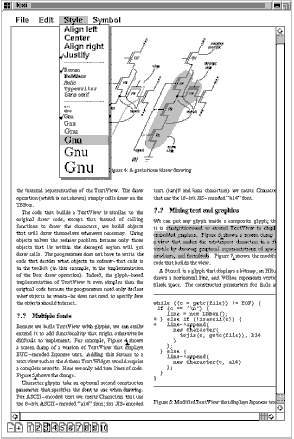

# 2.1 설계 문제들
Lexi 설계에 들어가는 일곱 가지 현안들을 살펴봅시다.
### 그림 2.1

1. 문서 구조
  - 문서의 내부를 어떻게 표현할 것인지는 Lexi 설계의 모든 측면에서 영향을 줍니다. 편집, 서식 설정, 화면 표시, 텍스트 분석 등을 구현하려면 이 문서 표현 구조를 종횡무진 훑어가야 합니다. 이 문서 정보를 어떻게 구성할 것인가에 따라 프로그램의 나머지 설계도 크게 달라질 것입니다.
2. 서식 설정
  - Lexi는 실제로 문자와 그래픽을 행과 열로 어떻게 정렬할까요? 여러 가지 서식화 정책을 처리할 책임은 어떤 객체가 가져가야 할까요? 이런 방침들이 문서의 내부 표현과 어떻게 상호작용할 수 있을까요?
3. 사용자 인터페이스 꾸미기
  - Lexi의 사용자 인터페이스는 스크롤바, 테두리, 음영 등의 장식 요소들을 포함합니다. 이런 장식은 Lexi 사용자 인터페이스가 진화하면 쉽게 바뀝니다. 그러므로 나머지 응용프로그램을 중단하지 않고 장식을 쉽게 추가하고 제거할 수 있어야 합니다. 
4. 여러 룩앤필(look and feel) 표준의 지원
  - Lexi는 심각한 수정없이 모티프(Motif)와 프레젠테이션 매니저(Presentation Manager: PM) 같은 다른 룩앤필 표준을 쉽게 지원할 수 있어야 합니다.
5. 여러 윈도우 시스템의 지원
  - 일반적으로 특정한 룩앤필 표준은 특정한 윈도우 시스템에서 구현됩니다. 그러므로 Lexi의 설계는 가급적 윈도우 시스템에 독립적이어야 합니다.
6. 사용자 조작
  - 사용자는 버튼이나 풀다운 메뉴 등 사용자 인터페이스를 사용해서 Lexi를 제어합니다. 이 인터페이스는 숨겨진 실제 응용프로그램의 기능은 응용프로그램을 구성하는 전체 객체에 분산됩니다. 그러므로 분산된 기능에 접근하거나 이 기능 수행의 영향을 취소하는 데에 동일한 방법을 쓸 수 있도록 해야 합니다.
7. 철자 검사와 붙임표 처리
  - 어떻게 Lexi 단어 검사와 붙임표(hyphen)결정과 같은 분석 연산을 처리할 수 있을까요? 새로운 분석 연산을 추가할 때도 수정 또는 추가할 연산의 개수를 어떻게 최소화할 수 있을까요?

다음 장에서는 이런 설계 문제들을 좀 더 상세하게 다룰 것입니다. 각 문제는 달성할 목표가 무엇이고 이를 달성하는 데 우리가 갖고 있는 제약이 무엇인지를 정의합니다. 구체적인 해법을 제안하기에 앞서 목표와 제약의 세부사향을 설명할 것입니다. 문제와 이를 해결하는 해법을 통해 우리는 하나 이상의 패턴을 예시할 수 있으므로 각 문제를 위한 논의를 통해 관련된 패턴을 소개할 것입니다.