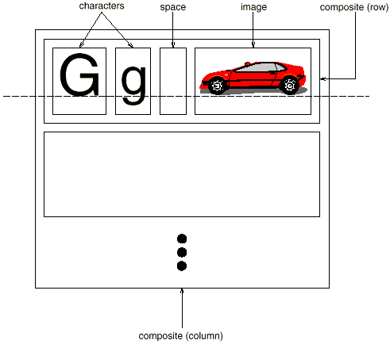
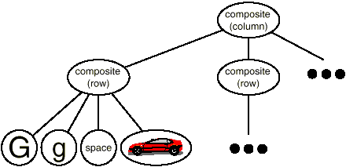
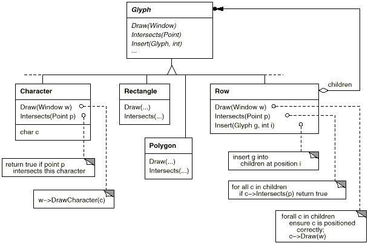

# 2.2 문서 구조
문서는 문자, 선, 다각형 등 기본적인 그래픽 요소를 단순히 배열한 것입니다. 이런 요소들을 통해서 문서의 전체 내용을 정의할 수 있게 됩니다. 그러나 설계자는 종종 이런 요소를 그래픽 요소로 보지 않고 각각 행, 열, 그림, 표, 아니면 다른 형태의 하위 구조 등의 물리적 구조로 봅니다(한편, 문서의 지은이는 문서를 논리적인 구조로 바라봅니다. 이를테면, 문장, 단락, 절, 소절, 장 단위로 말이죠. 이러한 예를 간단하게 하기 위해, 본 설계에서는 이러한 논리적 구조에 대한 정보를 내부 표현부에 명시적으로 저장하지는 않을 것입니다. 하지만 여기서 보이는 설계 방법은 논리적 구조 정보 등을 표현하는 데에도 마찬가지로 잘 적용할 수 있습니다). 또한 이 하위 구조는 또 다른 하위 구조를 포함할 수 있습니다.

Lexi의 사용자 인터페이스는 사용자가 이들 하위 구조를 직접 다룰 수 있어야 합니다. 예를 들어, 사용자는 다이어그램을 하나의 단위로 다루어야 하며, 이 다이어그램을 개별적 그래픽 요소들이 모인 집합체로 생각해서는 안 됩니다.

또한 테이블을 하나로 조작할 수 있어야지, 테이블을 텍스트와 그래픽 요소들이 대량으로 모인 것으로 보면 안 됩니다. 이렇게 해야 인터페이스를 직관적이고 간단하게 만들 수 있습니다. Lexi의 구현에 비슷한 품질을 부여하려면 문서의 물리적 구조에 부합하는 내부 표현을 선택합니다.

우선적으로, 본 편집기의 내부 표현은 다음 열거한 항목을 지원해야 합니다.

- 문서의 물리적 구조 유지 기능: 이 물리적 구조란 문자와 그래픽, 행, 열, 테이블, 기타 것들의 정렬을 의미합니다.
- 문서를 시각적으로 생성하고 표현하는 부분
- 내부 표현 영역의 요소들과 화면에 표시된 요소들을 사상(寫像:어떤 집합의 임의의 원소가 다른 집합의 하나의 원소에 대응하는 일)하는 부분
  - 이것이 있어야 사용자가 시각적 표현에 있는 무엇인가를 선택할 때 사용자가 어떤 요소를 가리킨 것인지를 Lexi가 결정할 수 있습니다.

이들 목표를 축으로 해서, 부가적으로 제약 사항 몇 개가 추가됩니다. 첫째, 문자와 그래픽을 동일하게 다뤄야 합니다. 본 편집기의 인터페이스는 사용자가 그림 안에서 문자를 넣거나 문자 안에서 그림을 넣을 수 있게 합니다. 그러므로 그림을 텍스트의 특별한 경우로 처리하거나 텍스트를 그림의 특별한 경우로 처리해서는 안 됩니다. 서로를 서로의 특별한 경우로 처리한다면, 텍스트와 그림을 모두 처리하는 데에 작업이 중복됩니다. 따라서 서식을 맞추거나 조작 기법을 한 번만 정의해서 문자와 그래픽 모두를 처리할 수 있어야 합니다.

둘째, 단일 요소와 그룹 요소를 구분해서 구현하면 안 됩니다. Lexi는 단일 요소와 복합 요소를 동일하게 다룰 수 있어야만 임의의 복잡한 문서를 다룰 수 있습니다. 예를 들어, 2열 5번째 행 10번째 요소가 하나의 문자일 수도 있고, 수많은 하위 요소를 갖는 복잡한 다이어그램일 수도 있습니다. 이 요소는 스스로 자신을 그리고 차원을 표시할 수 있는 대상이지, 그것이 복잡하다고 해서 페이지의 어디에 나타낼까, 어떻게 보이게 할까에 대한 추가 부담을 가질 필요는 없습니다.

허나, 철자법 검사와 붙임표 연결 지점 같은 처리를 하기 위한 텍스트 분석은 필요합니다. 두 번째 제약 사항에 반대되는 입장이지요. 선이 단순 객체인지 복합 객체인지에 대한 고려는 하지 않으려고 합니다. 그러나 가끔은 분석 대상에 따라서 분석 방법이 달라져야 합니다. 즉, 다각형의 철자 검사를 하거나 다각형을 붙임표로 연결한다는 것은 이상한 일이거든요. 그러므로 내부 표현을 설계할 때는 이러한 사항들 간의 충돌을 고려해야 합니다. 다시 말해, 어떤 때는 모든 요소들을 서로 동일하게 다루어야 하고, 어떤 때는 서로 구분해서 처리해야 합니다.
## 재귀적 합성
### 그림 2.2 문자와 그래픽의 재귀적 합성

### 그림 2.3 문자와 그래픽의 재귀적 합성을 위한 객체 구조


계층적으로 구조화된 정보를 보여주는 가장 일반적인 방법으로 **재귀적 합성(recursive composition)** 기법이 있습니다. 이 기법을 이용하면 단순한 것에서 복잡한 것을 점진적으로 만들어 낼 수 있지요. 쉽게 말해, 재귀적 합성은 간단한 그래픽 요소들을 복합하여 문서를 만드는 방법입니다. 첫 단계에서 문서에 있는 한 행(row)의 왼쪽에서 오른쪽으로 글자들과 그래픽들을 채웁니다. 그러면 여러 선들이 하나의 열(column)을 만들게 되고, 다수의 열이 하나의 페이지를 만듭니다. [그림 2.2]()를 봅시다.

[그림 2.2]()와 같은 물리적 구조를 표현하는 데 있어서, 각각의 주요 요소를 모두 객체로 만들어 구현할 수 있습니다. 이렇게 하면 글자나 그래픽과 같은 시각적 요소뿐만 아니라 보이지 않는 구조적 요소(선, 열 등)도 포함할 수 있습니다. 이 결과로 만들어 객체 구조는 [그림 2.3]()과 같습니다.

문서에 정의할 글자와 그래픽 요소를 객체화하면 Lexi 설계의 유연성을 늘릴 수 있게 됩니다. 이제는 문자와 그래픽 모두를 바라보는 방법이 같아집니다. 즉, 화면에 표시하고 서식을 지정할 수 있으며 다른 것들 안에 포함될 수 있는 대상으로 동일시 합니다. 이렇게 함으로써 다른 기능에 영향을 주지 않고 새 글자를 추가할 수도 있습니다. Lexi의 객체 구조는 문서의 물리적 구조를 그대로 따르게 됩니다.

이 접근법에는 두 가지 중요한 의미가 내포되어 있습니다. 첫째, 각 객체에 대응하는 클래스가 필요합니다. 둘째, 이 클래스는 객체들을 일관되게 다루기 위해 호환성을 갖는 인터페이스를 정의해야 합니다. 그러나 두 번째 사항은 확정적인 것은 아닙니다. C++와 같은 언어에서 인터페이스를 호환성 있게 만드는 방법은 관련된 클래스들을 상속을 통해 묶는 것인데, 그러면 부모 클래스에 공통의 인터페이스를 정의할 수 있습니다.

## 글리프
### 그림 2.4 부분적 글리프 클래스 계통

### 표 2.1 기본 glyph 인터페이스
|책임|연산|
|---|---|
|외형|virtual void Draw(Window*)<br>virtual void Bounds(Rect&)|
|선택 파악|virtual bool Intersects(const Point&)|
|구조|virtual void Insert(Glyph*, int)<br>virtual void Remove(Glyph*)<br>virtual Glyph* Child(int)<br>virtual Glyph* Parent()|

화면에 표시되는 구성요소를 포괄적으로 일컫는 개념인 글리프(glyph)는, 본 편집기의 문서 구조에서 나타낼 수 있는 모든 객체를 위한 추상 클래스인 Glyph로 정의하려 합니다. Glyph의 서브클래스는 기본적인 그래픽 요소(문자와 이미지 같은)와 구조적 요소(행과 열 같은)를 정의합니다. [그림 2.4]()에서는 Glyph 클래스 계층을 보여주며, [표 2.1]()에서는 C++ 언어 형식으로 glyph 인터페이스를 정의하였습니다.

글리프의 서브클래스는 `Draw()` 연산을 재정의해서 윈도우에 자신을 그립니다. `Draw()` 연산의 호출이 일어날 때 Window 객체에 대한 참조자를 전달받습니다. **Window** 클래스는 스크린의 윈도우에 텍스트와 기본 도형을 표현하기 위한 그래픽 연산을 정의합니다. Glyph의 서브클래스인 **Rectangle** 클래스는 다음과 같이 `Draw()` 연산을 재정의합니다.
``` c++
void Rectangle::Draw (Window* w) {
  // Window 객체에 대한 참조자 * w를 매개변수로 전달받음
  w->DrawRect(_x0, _y0, _x1, _y1);
}
```
`_x0`,`_y0`,`_x1`과 `_y1`은 `Rectangle`의 멤버 변수로 정의되어 사각형의 대각 위치에 있는 양 모서리의 좌표를 나타냅니다. `DrawRect()` 연산은 직사각형을 화면에 그리는 윈도우 연산입니다.

부모 클래스는 서브클래스가 얼마나 많은 공간을 차지하는지 알아야 할 때가 있습니다. 예를 들어, [그림 2.3]()에서처럼 그림들이 중첩되지 않도록 한 행에 정렬해야 할 때 공간의 크기를 알 필요가 있는 것입니다. `Bounds()` 연산은 글리프가 차지하는 직사각형의 면적을 반환합니다. 값은 글리프가 포함하는 가장 작은 직사각형에 대응되는 모서리를 반환합니다. `Glyph` 클래스를 상속받는 서브클래스들은 사각형의 면적을 구할 수 있도록 연산을 재정의합니다.

`Intersects()` 연산은 어떤 점이 글리프와 교차하는지를 반환합니다. 사용자가 문서 위의 어떤 지점을 클릭하면 Lexi는 `Intersects()` 연산을 호출해서 어떤 글리프가 마우스 아래 있는 것인지 판단합니다. `Rectangle` 클래스는 이 연산을 재정의해서 점과 사각형 간에 교차되는 지점을 구합니다.

글리프는 자식을 가질 수 있기 때문에, 그 자식들을 추가하고, 삭제하며, 접근할 공통의 인터페이스가 필요합니다. 예를 들어, Row의 자식들은 행으로 정렬된 글리프입니다. `Insert()` 연산은 정수 지정번호(index)[(5)]()에 정의한 특정 위치에 글리프를 삽입합니다. `Remove()` 연산은 자식이 필요하지 않을 때 정의한 글리프를 제거합니다.

`Child()` 연산은 해당 지정번호의 위치에 자식이 있다면 그 자식을 반환합니다. 자식들을 갖는 Row 클래스 같은 글리프는 자식의 데이터 구조에 직접적으로 접근하는 대신 내부적으로 `Child()` 연산을 이용해야 합니다. 이렇게 하면 자식들을 저장하는 데이터 구조를 배열에서 연결 리스트로 바꾸더라도, 자식들에게 반복 적용하는 `Draw()`연산을 바꿀 필요가 없겠지요. 이와 비슷하게, `Parent` 클래스는 글리프의 부모에게 표준화된 인터페이스를 제공합니다. Lexi에서 Glyph는 부모의 참조자를 저장하고, `Parent()` 연산은 그냥 그 참조 값을 반환합니다.

## 복합체 패턴
재귀적 합성은 단순한 문서 이상의 것을 처리할 때 좋은 방법입니다. 재귀적 합성을 이용해서 복잡한 계층적 구조를 표현할 수 있습니다. 복합체 패턴은 객체지향 관점에서 재귀적 합성을 표현하는 패턴입니다.


### (5)
정수 지정번호는 아마 글리프가 사용하는 데이터 구조에 따라 글리프의 자식을 지정하는 최상의 방법은 아닐 것입니다. 만약, 글리프가 사용하는 자료 구조가 연결 리스트(linked list)라면, 리스트를 가리키는 포인터를 쓰는 게 더 효율적일 것입니다. 원소 지정 문제에 대한 좀 더 괜찮은 해결 방법은 문서 분석에 대해 논의하는 [2.8 철자 검사 및 붙임표 연결](https://github.com/wonder13662/my-books/blob/writing/GOF-design-patterns/Chapter02/2-8.md)에서 보도록 합니다.

