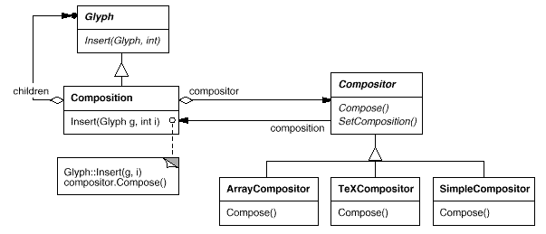
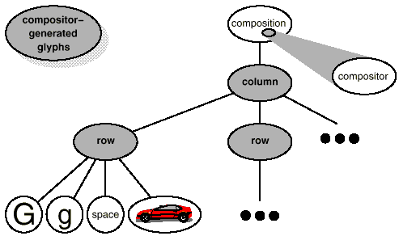

# 2.3 서식 설정
지금까지는 문서의 물리적 구조를 표현하는 방법을 알아보았습니다. 이제는 알맞게 서식화된 문서에 맞는 물리적 구조를 어떻게 만드는지 살펴봅시다. 편집기에서 문서 표현과 서식 설정은 완전히 다른 영역입니다. 문서의 물리적 구조를 저장하는 능력이 서식에 맞는 특정 구조를 만들어 내는지를 알려주지는 않습니다. 이런 부분은 거의 Lexi 구현자의 책임으로 돌아갑니다. 구현자는 텍스트를 라인으로 나누고 라인을 열로 구분하는 등 사용자의 수준높은 기대에 부응해야 합니다. 예를 들어, 사용자는 한 칸 띄우기 또는 두 칸 띄우기 등으로 여백의 폭을 다양하게 하고 싶기도 하고, 들여쓰기를 하고 싶기도 하고, 표를 만들어 싶어 하는 등 요구 사항이 가지가지입니다.[(6)](https://github.com/wonder13662/my-books/blob/writing/GOF-design-patterns/Chapter02/2-3.md#6) Lexi의 서식 설정(formatting) 알고리즘은 이것을 모두 고려해서 만들어야 합니다.

거두절미하고, 이 책에서는 "서식 설정"의 의미를 글리프 집합을 라인으로 분해하는 의미로만 한정할 것입니다. 사실상 "서식 설정"과 "라인 분해"라는 두 용어는 이제부터 서로 섞어 써도 무방한 수준이 되니 마음 단단히 드세요. 이제부터 다루려는 기술은 라인을 열로 분할할 때나 열을 페이지로 분리할 때도 동일하게 적용할 수 있습니다.

### (6)
사용자는 문장, 단락, 절, 장, 그 밖에도 여러 가지 문서의 논리적 구조에 관해서 더 관심이 있습니다. 물리적 구문은 비교적 관심이 덜 합니다. 사람들은 대부분 적당히 서식 문서화된 단락에서 발생하는 라인 분해는 상관하지 않습니다. 열과 페이지를 서식 문서화하기 위한 것도 마찬가지입니다. 사용자는 물리적 구조에 대해서는 개략적인 수준의 제약 사항만을 명시할 뿐이고, 자신의 요구를 만족시키는 어려운 일들은 실제로 Lexi에게 맡깁니다.
## 서식 설정 알고리즘의 캡슐화
모든 제약 조건과 상세함을 가진 서식 설정 절차를 자동화하기란 쉬운 일이 아닙니다. 이런 문제에 대한 접근법은 여러 가지가 있는데, 각각 다른 강점과 약점을 가진 다양한 서식 설ㅈ어 알고리즘을 사용할 수 있습니다. Lexi는 WYSIWYG 편집기이므로 중요하게 고려할 사항은 서식 설정의 품질과 서식 설정에 필요한 속도를 어떻게 균형있게 잘 맞추느냐 하는 것입니다. 다시 말해, 문서가 화면에 표시되는 외양의 품질을 유지하면서 적정한 시간 안에 처리되어야 합니다. 이러한 균형을 맞추려면 여러 가지 요인들을 고려해야 하는데, 모든 요인을 컴파일 시점에 결정할 수는 없습니다. 더 품질이 좋은 서식이 설정된다면 좀 더 느린 응답 시간을 참을 수 있는 사용자도 있을 테니까요. 따라서 어떤 것이 더 중요하냐에 맞추어 현재 알고리즘보다 더 합당한 다른 서식 설정 알고리즘을 만들어 낼 수도 있습니다. 또한 구현 입장에서 보면, 속도와 저장 용량 간의 균형도 필요합니다. 얼마나 많은 정보를 저장하고 있느냐에 따라 속도가 빨라지기도, 느려지기도 하기 때문입니다.

서식 설정 알고리즘은 복잡한 경향이 있기 때문에, 알고리즘은 문서 구조에 독립적이면서 잘 정의된 형태를 유지해야 합니다. 이상적으로는 서식 설정 알고리즘과 상관없이 새로운 Glyph 클래스의 서브클래스를 추가할 수 있어야 합니다. 반대로 새로운 서식 설정 알고리즘을 추가한다고 기존의 Glyph 클래스를 변경해서는 안됩니다.

Lexi를 설계할 때, 런타임에는 힘들겠지만 적어도 컴파일 시점에는 서식 설정 알고리즘을 쉽게 변경할 수 있도록 설계해야 합니다. 이를 위해서, 알고리즘을 별도의 객체로 둘러싸서 쉽게 대체 가능하도록 할 수 있습니다. 우선, 서식 설정 알고리즘을 캡슐화한 객체별로 클래스 계층을 별도로 정의할 것입니다. 클래스 계층의 루트인 최상위 클래스는 다양한 서식 설정 알고리즘을 지원할 수 있는 인터페이스를 정의하고, 각 서브클래스가 특별한 알고리즘을 수행하도록 인터페이스를 구현합니다. 그리고 Glyph 클래스의 서브클래스를 통해 특정 알고리즘 객체를 이용하게 하여 자식들을 자동으로 구조화시킬 수 있습니다.
## 합성자와 복합
서식 설정 알고리즘을 캡슐화할 수 있는 객체를 **Compositor** 클래스로 정의합니다. **Compositor** 클래스에서 정의한 인터페이스는 서식을 지정할 클리프가 **무엇** 인지(SetComposition() 연산), 서식 설정은 **언제** 해야 하는지(Compose() 연산)를 알 수 있게 하는 연산을 정의하였습니다. 이에 해당하는 인터페이스를 [표 2.2](https://github.com/wonder13662/my-books/blob/writing/GOF-design-patterns/Chapter02/2-3.md#%ED%91%9C-22)에 정의하였습니다. 
### 표 2.2 
#### Compositor 클래스의 인터페이스
|책임|연산|
|---|---|
|무엇을 설정할 것인가|void setComposition(Composition*)|
|언제 설정할 것인가|virtual void Compose()|
**Compositor** 클래스가 포맷을 지정하는 글리프는 **Glyph** 클래스의 특정 서브클래스인 **Compositor** 클래스와 자식 관계([그림 2.5](https://github.com/wonder13662/my-books/blob/writing/GOF-design-patterns/Chapter02/2-3.md#%EA%B7%B8%EB%A6%BC-25)의 children)를 갖는 객체들입니다. **Composition** 인스턴스는 자신이 생성될 때 **Compositor** 서브클래스의 인스턴스를 얻고, 서식 설정이 필요할 때 **Compositor** 인스턴스에게 `Compose()` 연산을 호출하여 서식을 지정하게 합니다. [그림 2.5](https://github.com/wonder13662/my-books/blob/writing/GOF-design-patterns/Chapter02/2-3.md#%EA%B7%B8%EB%A6%BC-25)는 지금 설명한 **Composition**과 **Compositor** 클래스 간의 관련성을 보여줍니다.

**Composition** 클래스는 **Glyph** 클래스의 서브클래스이면서 다시 **Glyph** 클래스의 인스턴스를 집합 관계의 자식으로 포함합니다. 이 구조의 의미는, **Composition** 인스턴스는 Glyph의 인스턴스를 포함할 수도 있고, 또 다른 **Composition** 인스턴스를 포함할 수도 있다는 것입니다. 서식이 없는 **Composition** 객체는 문서의 기본 내용을 복합하는 시각 효과 담당 글리프만 가지고 있습니다. 즉, 문서의 물리적 구조를 결정하는 Row와 Column 같은 글리프는 포함하지 않습니다. 이 **Composition** 객체는 현재 생성되었으며, 그와 동시에 자신이 직접 서식을 정해 주어야 하는 글리프들로 초기화된 상태입니다. **Composition** 객체는 서식을 설정할 때 **Compositor** 객체의 `Compose()` 연산을 호출합니다. 이후에 이 객체는 **Composition** 객체와 자식 관계에 있는 인스턴스를 라인 분리 알고리즘에 따라서 반복적으로 생성하면서 새로운 Row와 Column 글리프를 삽입합니다.[(7)](https://github.com/wonder13662/my-books/blob/writing/GOF-design-patterns/Chapter02/2-3.md#7) [그림 2.6](https://github.com/wonder13662/my-books/blob/writing/GOF-design-patterns/Chapter02/2-3.md#%EA%B7%B8%EB%A6%BC-26)은 그 결과로 만들어진 객체 구조입니다. **Compositor** 객체가 생성하고 객체 구조에 삽입한 글리프를 회색으로 표시하였습니다.

### 그림 2.5
#### Composition 클래스와 Compositor 클래스 간의 관련성

### 그림 2.6
#### Compositor에 따라 라인 분리를 반영한 객체 구조

각 **Compositor** 클래스는 서로 다른 라인 분리 알고리즘을 구현합니다. 예를 들어, **SimpleCompositor** 클래스는 문서의 색깔과 같은 난해한 특성들에 상관없이 지나갈 수 있고, 적당한 색깔의 의미는 텍스트와 공백이 균등하게 분산되었음을 의미합니다. **TeXCompositor** 는 TeX 알고리즘을 모두 완전하게 구현하는 클래스입니다.

이렇게 Compositor-Composition으로 클래스를 구분해두면, 문서의 물리적 구조와 다른 서식 설정 알고리즘을 지원하는 코드 사이를 확실히 구분할 수 있습니다. **Glyph** 클래스를 고치지 않고도 새로운 **Compositor** 서브 클래스를 추가할 수 있고, **Compositor** 서브클래스를 고치지 않고 새로운 **Glyph** 클래스를 추가할 수 있습니다. 클래스 분리는 문서의 물리적 구조를 지원하는 코드 및 다른 서식 설정 알고리즘을 위한 코드가 확실히 분리될 수 있도록 해 줍니다. 이외에, **Composition** 클래스의 기본 글리프 인터페이스에 `SetCompositor()` 연산을 추가함으로써 런타임에 라인 분리 알고리즘을 변경할 수 있습니다.
#### (7)
복합자는 라인 분해를 계산하기 위해 Character 글리프들의 문자 코드를 얻어야 합니다. [2.8 철자 검사 및 붙임표 연결](https://github.com/wonder13662/my-books/blob/writing/GOF-design-patterns/Chapter02/2-8.md)을 보면 Glyph 인터페이스에 문자 처리용 연산을 추가하지 않고 어떻게 문자 정보를 다형적으로 얻어내는지를 확인할 수 있습니다.
## 전략 패턴
알고리즘을 객체로 캡슐화하는 것, 이것이 전략 패턴의 의도입니다. 이 전략 패턴의 주요 참여자는 **Strategy** 패턴을 구현한 객체(서로 다른 알고리즘을 캡슐화한)와 이 객체가 동작할 전후 관계, 즉 동작 환경(context)입니다. **Compositor** 클래스가 이 **Strategy** 클래스에 해당하고 이 클래스들이 서로 다른 서식 설정 알고리즘을 캡슐화합니다. **Composition** 클래스는 **Compositor** 클래스의 전략에 대한 **Context** 클래스에 해당합니다.

전략 패턴을 적용하는 데 가장 중요한 것은 전략과 동작 환경에 대한 인터페이스를 충분히 일반화해야 한다는 것입니다. 이로써 이들 일반화된 인터페이스가 어느 정도 범위의 알고리즘을 지원할 수 있어야 합니다. 새로운 알고리즘을 지원하기 위해서 전략이나 배경 인터페이스를 변경할 필요는 없습니다. 현재의 예를 보면 Glyph 클래스에 정의한 인터페이스는 자식을 읽고 쓰는 기능 및 삽입하며 삭제하는 기능을 지원합니다. 이 인터페이스를 통해서 **Compositor**의 서브클래스들은 문서의 물리적 구조를 변경할 수 있습니다. 이와 같이 **Compositor** 인터페이스는 서식 설정을 초기화할 때 필요한 것들을 모두 **Composition** 객체들에게 넘겨줍니다.