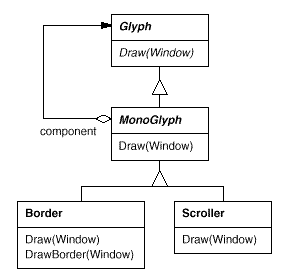
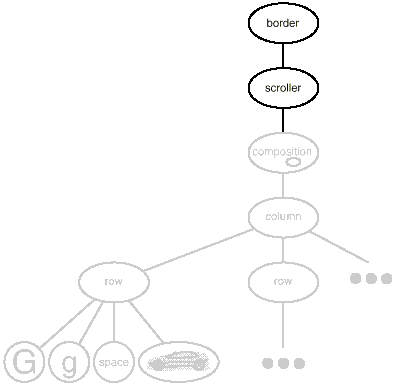

# 2.4 사용자 인터페이스 장식하기
Lexi의 사용자 인터페이스를 장식하는 데 있어서 고려할 부분은 두 가지입니다. 첫번째는 텍스트의 페이지를 분리하기 위한 텍스트 편집 영역 주변의 테두리이고, 두 번째는 페이지의 서로 다른 부분을 볼 수 있도록 하는 스크롤바입니다. 새로운 장식을 쉽게 추가하려면(특히, 런타임에), 상속을 써서 사용자 인터페이스에 장식 요소를 추가하면 안 됩니다. 다른 사용자 인터페이스에는 이런 장식 요소가 있을지도 모른다는 가정 아래 설계해야만 사용자 인터페이스 설계의 유연성을 보장할 수 있습니다. 이것이 제대로 되어야 다른 클래스의 변경 없이 장식 요소를 추가하고 삭제할 수 있게 됩니다.
## 투명한 포함
프로그래밍 관점에서 볼 때, 사용자 인터페이스에 장식을 추가한다는 것은 결국 기존 코드의 확장이 필요하다는 뜻을 내포합니다. 그런 확장을 위해 상속을 사용하게 되면 런타임에 장식을 재배열하는 것을 사전에 막을 수 있지만, 상속기반 접근 방법을 사용할 때에 생기는 클래스 급증 문제도 가히 만만치 않게 됩니다.

그러니까 **Composition** 클래스를 상속하는 **BorderedComposition** 클래스로 테두리를 추가할 수 있을 것입니다. 또는, 동일한 방법으로 **ScrollableComposition** 서브클래스에 스크롤링 인터페이스를 추가해도 되고요. 스크롤바와 테두리를 모두 원한다면 상속에 의해 **BorderedScrollableComposition** 클래스를 만들면 됩니다. 이렇게 하면 모든 가능한 조합에 따라 클래스를 만들 수 있습니다. 그러나 장식의 종류가 많아질 때마다 클래스를 만드는 이런 해법은 언젠가는 더 이상의 확장을 불가능하게 합니다.

이럴 때는 객체 합성이 훨씬 더 유연한 확장 방법이 될 수 있습니다. 그러나 어떤 객체를 합성해야 할까요? 기존에 존재하는 글리프에 장식을 적용한다는 점은 기정사실이기 때문에(즉, 꾸밀 대상은 기존에 존재하는 글리프이므로), 장식 자체를 별도의 객체로 만들면 됩니다. 다시 말해, **Border** 클래스의 인스턴스로 기존 글리프들을 장식하면 됩니다. 이 과정을 통해서 복합할 수 있는 두 개의 후보가 생기게 됩니다. 하나는 글리프이고, 다른 하나는 테두리입니다. 이렇게 한 다음, 누가 누구를 포함할 것인지를 결정합니다. 실제 사용자 인터페이스를 보면 화면에 있는 글리프들은 테두리가 둘러싸고 있기 때문에 글리프를 테두리가 둘러싸게 만드는 쪽이 자연스러운 방법으로 보입니다. 그러나 정반대로도 할 수 있습니다. 즉, 테두리를 글리프 안에 넣는 것입니다. 이렇게 하면 테두리를 포함하는 **Glyph** 서브클래스를 변경해서 각각의 클래스들이 테두리에 대해 알도록 해야 합니다. 여기서는 테두리가 글리프를 포함하도록 만드는 첫 번째 방법으로 갑니다. 이렇게 하면, 추가한 장식 클래스에 해당하는 **Border** 클래스에 테두리를 그리는 코드만 작성하는 것으로 간단히 정리되며, 다른 기존의 클래스는 변경하지 않아도 됩니다.

**Border** 클래스는 어떻게 생겼을까요? 외관을 갖는 테두리도 개념적으로는 글리프의 일종이기 때문에 **Border** 클래스도 **Glyph**의 서브 클래스여야 합니다. 이렇게 하는 중요한 이유는 테두리가 있는 그림인지 아닌지를 사용자가 글리프를 몰라도 사용할 수 있어야 하기 때문입니다. 사용자가 평범하고 테두리 없는 글리프에 그리라고 요청할 때면 테두리 장식 없이 기본 모양만 그려야 합니다. 글리프가 테두리에 포함되어 있어도 사용자는 글리프를 포함하는 테두리를 전혀 다른 방법으로 다루어서는 안 됩니다. 단지, 이전의 평범한 글리프를 다룰 때처럼 복합 글리프에게 그리라고 말하면 됩니다. 다시 말해, 평범한 글리프이건 테두리를 포함한 글리프이건 동일하게 취급할 수 있어야 합니다. 즉, **Border** 인터페이스가 **Glyph** 인터페이스와 일치한다는 뜻입니다. 이런 관계를 보장하기 위해 **Border** 클래스를 **Glyph** 클래스에 상속합니다.

지금까지의 것들을 모두 모아놓으면 투명한 포함(transparent enclosure) 개념을 끌어낼 수 있습니다. 이는 (1)단일 자식(다른 말로 단일 구성요소)에 기반을 둔 합성과 (2)호환되는 인터페이스의 개념을 조합한 것입니다. 사용자는 그들 자신이 단일 구성요소를 다루는지, 아니면 단일 구성요소를 포함하는 복합 객체를 다루는지 전혀 구분할 수 없습니다. 특히 포함한 것이 자신의 연산을 자신이 포함하는 구성요소에 위임할 때라면 더 구분하기 어렵습니다. 그러나 포함을 담당한 주체가 다른 구성요소에 연산 처리를 위임하기 전 또는 후에 자신의 행동을 수행하도록 하면, 그 구성요소의 행동을 확장할 수도 있게 됩니다. 이로써 무엇인가를 포함하는 복합 객체는 구성요소에 상태를 효과적으로 추가할 수 있습니다.
## 단일 글리프
[투명한 포함]() 개념은 다른 글리프를 꾸미는 모든 글리프에 적용할 수 있습니다. 이 개념을 구체적으로 만들기 위해서, Border 같은 "장식 글리프"를 위한 추상 클래스로 **MonoGlyph** 클래스를 **Glyph** 클래스의 서브클래스로 정의합니다. 이 관계는 [그림 2.7](https://github.com/wonder13662/my-books/blob/writing/GOF-design-patterns/Chapter02/2-4.md#%EA%B7%B8%EB%A6%BC-27)에 정의하였습니다.

### 그림 2.7
#### MonoGlyph 클래스 관련성


**MonoGlyph**의 서브클래스들은 적어도 이 전달 연산 가운데 하나를 재구현합니다. 예를 들어 `Border::Draw()` 연산은 먼저 부모 클래스 연산인 `MonoGlyph::Draw()`를 호출해서 테두리를 제외한 다른 기본 요소들을 그리도록 합니다. 그러고나서 비공개(private) 연산인 `DrawBorder()`를 호출해 테두리를 그리게 합니다. 연산 내부의 자세한 부분은 물론 생략했습니다.

```c++
void Border::Draw (Window* w) {
  MonoGlyph::Draw(w);
  DrawBorder(w);
}
```
`Border::Draw()` 연산이 어떻게 부모 클래스의 연산을 효과적으로 확장해서 테두리를 그리는지 주의해서 봅시다. 서브클래스는 `Border::Draw()`를 구현할 때 부모 클래스에서 구현한 연산을 이용합니다. 이렇게 하는 것은 `MonoGlyph::Draw()`를 이용하지 않고 부모 클래스의 연산을 완전하게 대체하는 것과는 다른 방법입니다.

[그림 2.7](https://github.com/wonder13662/my-books/blob/writing/GOF-design-patterns/Chapter02/2-4.md#%EA%B7%B8%EB%A6%BC-27)의 **MonoGlyph** 서브클래스인 **Scroller** 클래스도 추가된 두 개의 스크롤바가 갖는 위치에 따라서 구성요소를 그리는 **MonoGlyph** 클래스의 일종입니다. **Scroller** 클래스가 구성요소를 그릴 때 그래픽 시스템은 구성요소가 속한 영역을 잘라내도록 동작하는데, 구성요소의 잘린 부분은 눈에 보이는 부분에서는 사라지지만 스크린의 전체 내용에는 포함되어 있습니다.

Lexi의 텍스트 편집기에 테두리를 만들고 화면 영역을 스크롤하는 인터페이스를 추가하는 데 필요한 모든 준비를 하였습니다. 이제 스크롤 인터페이스를 추가하기 위해 Scroller 인스턴스에 Composition 인스턴스와 Border 인스턴스를 넣습니다. 그 결과로 만들어진 객체 구조는 [그림 2.8](https://github.com/wonder13662/my-books/blob/writing/GOF-design-patterns/Chapter02/2-4.md#%EA%B7%B8%EB%A6%BC-28)과 같습니다.

### 그림 2.8
#### 장식된 객체의 구조



이번에는 복합의 순서를 반대로 해 봅시다. 테두리를 갖는 복합 객체를 **Scroller** 인스턴스에 넣어봅시다. 이때, 테두리는 텍스트와 함께 이동할 수 있습니다. 이런 결과는 원했던 것일 수도 있고, 원하지 않은 것일 수도 있습니다. 여기서 잘 보셔야 할 부분이 있습니다. 사용자 쪽에서는 이러한 복합을 알지 못하기 때문에 다양한 대안들을 쉽게 시험해 볼 수 있으며, 어떤 대안을 통해 내부 구현 방법이 바뀌더라도 사용자는 변화를 전혀 눈치채지 못합니다.

테두리가 어떻게 두 개 이상이 아닌 하나의 글리프만을 복합하는지 알아봅시다. 사실 이 부분은 지금까지 정의한 일반적인 복합 방법은 아닙니다. 일반적 복합에서 부모 객체는 무수히 많은 자식들을 가질 수 있었습니다. 그러나 "무엇인가"에 테두리를 만든다고 했을 때, 이 "무엇인가"의 개수는 한 개입니다. 한 번에 하나 이상의 객체를 꾸밀 수도 있지만, 그렇데 되면 꾸민다는 개념에 다양한 종류의 복합을 혼합해야 합니다. 즉, 장식마다 새로운 개념을 만들어 내는 셈입니다. 예를 들어, 행 장식, 열 장식 등을 계속 만들어 나가야 합니다. 그러나 이것은 별로 도움이 되지 않습니다. 왜냐하면 우리는 이미 이러한 종류의 복합을 지원하는 클래스를 갖고 있기 때문입니다. 그러므로 복합을 위해서는 이미 갖고 있는 클래스를 이용하고, 새로운 장식에 대해서만 새로운 클래스를 만드는 것이 바람직합니다. 장식을 복합과 독립적으로 관리함으로써 장식에 관련된 클래스를 단순화할 수 있고 클래스의 수도 줄일 수 있습니다. 또한 이미 존재하는 복합의 기능성을 복제할 필요도 없게 됩니다.
## 장식자 패턴
[4.4 장식자(Decorator)](https://github.com/wonder13662/my-books/blob/writing/GOF-design-patterns/Chapter04/4-4.md) 패턴은 "투명한 포함" 개념에 의해 장식을 지원하는 클래스와 포함되는 객체들 사이의 관계를 잡아낸 것입니다. 장식이라는 용어는 지금까지 언급해 왔던 것에 비해 더 넓은 의미를 가집니다. 장식자 패턴에서 "장식"은, 객체에 추가할 수 있는 모든 책임에 해당합니다. 장식에 해당하는 예로는, 처리부를 갖는 추상 구문 트리, 새로운 상태 전이를 갖는 유한 상태 오토마타(finite state automata), 속성 태그를 갖는 영속적 객체망 등이 있는데, 이것은 기본 객체에 추가적인 책임이 부여된 예들입니다. 장식자 패턴은 Lexi에 사용했던 방식을 좀 더 넓은 범위에서 사용할 수 있도록 해 줍니다.