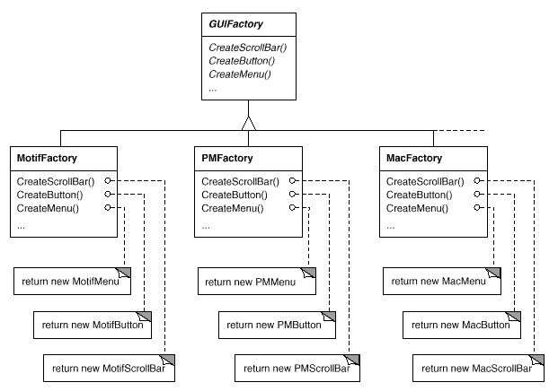
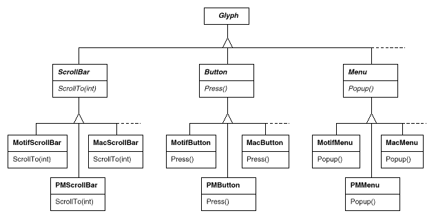

# 2.5 다양한 룩앤필 표준 지원
하드웨어와 소프트웨어 플랫폼 간의 이식성을 지원하는 것은 시스템 설계에 매우 중요한 일입니다. 새로운 플랫폼에 Lexi를 이식한다고 하더라도 심각한 정비가 필요없어야 합니다. 그렇지 않다면 새로운 플랫폼으로 이식하는 것 자체가 무의미합니다. 그러므로 우리는 가능하면 Lexi가 쉽게 이식될 수 있도록 설계해야 합니다.

이식성에서 걸림돌이 되는 한 가지는 룩앤필 표준의 다양성입니다. 이 표준은 응용 프로그램이 어떻게 화면에 표시되고 어떻게 사용자의 요청에 반응하는지에 대한 표준 지침을 정의합니다. 이미 존재하는 표준들이 많은 차이를 보이지 않을 뿐 아니라, 사람들은 서로 다른 표준 간의 큰 혼란을 느끼지 못합니다. 그러나 모티프를 기반으로 한 응용프로그램들은, 다른 플랫폼에서 이에 상응하는 응용프로그램과 완전히 똑같은 룩앤필을 갖고 있지는 않습니다. 하나 이상의 플랫폼에서 돌아가는 응용프로그램은 그 플랫폼에서 제공하는 고유한 사용자 인터페이스 스타일 지침을 따라야 합니다.

현재 설계 목표는 Lexi가 여러 개의 기존 룩앤필 표준을 따르게 만드는 동시에 새로운 표준이 나올 때마다 추가적으로 이들을 쉽게 지원하려는 것입니다. 또한 런타임에도 룩앤필을 변경할 수 있는, 최고의 유연성을 지원하는 설계를 만드는 것입니다.

## 객체 생성의 추상화
우리 눈에 보이고 Lexi의 사용자 인터페이스와 상호작용하는 것 모두가 글리프입니다. 보이지 않는 행이나 열도 글리프입니다. 이렇게 보이지 않는 글리프는 버튼과 글자와 같이 보이는 글리프들을 복합하기 위하여 이들을 적당하게 배치합니다. 이런 버튼이나 스크롤바, 메뉴 등과 같이 사용자 인터페이스에서 어떤 요소들을 제어할 때 동작하는 글리프들을 "위젯(widget)"이라고 합니다. 위젯은 데이터를 표현하기 위해서 글자, 원, 사각형, 다각형 등 더욱 단순한 글리프들을 이용할 수도 있습니다.

다양한 룩앤필을 구현하기 위해 다음 두 가지 종류의 Glyph 클래스들을 갖고 있다고 가정해 봅시다.

1. 위젯의 각 카테고리 별로 Glyph 클래스를 상속받는 서브클래스 집합. 예를 들어, ScrollBar, Button들은 Glyph를 상속받는 추상클래스입니다. 추상 클래스인 ScrollBar 클래스는 스크롤링 연산을 추가하여 기본 Glyph 인터페이스를 확장합니다. Button 클래스는 버튼 처리와 관련된 연산을 추가하여 기본 Glyph 인터페이스를 확장한 추상 클래스입니다.
2. 각 추상 클래스를 상속하여 서로 다른 룩앤필을 구현하는 서브클래스 집합. 예를 들어, `ScrollBar` 클래스를 상속하는 `MotifScrollBar` 클래스, `PMScrollBar` 클래스입니다. `MotifScrollBar` 클래스는 모티프 표준에 따라 연산들을 구현하고, `PMScrollBar` 클래스는 프레젠테이션 매니저에 따라 연산들을 구현합니다.

Lexi는 서로 다른 룩앤필에 대한 위젯들을 구분할 필요가 있습니다. 예를 들어, Lexi는 인터페이스에 버튼을 넣을 때 이것이 `MotifButton`인지, `PMButton`인지, `MacButton`인지 판단해서 정확한 버튼에 해당하는 서브클래스의 인스턴스를 만들어야 합니다.

C++의 생성자를 이용해서는 이런 방식의 구현이 불가능합니다. 즉, 생성자에 어떤 특정 스타일의 버튼을 생성하도록 직접 코딩하게 되면 런타임 스타일을 선택할 수 없습니다. 다른 플랫폼으로 Lexi를 이식하기 위해서 생성자를 변경해야 합니다. 버튼은 Lexi 사용자 인터페이스의 다양한 위젯 중 하나일 뿐입니다. 모든 위젯의 생성자마다 새로운 플랫폼에 적합한 인스턴스를 생성하도록 변경해야 한다면, 새로운 이식 요청이 들어올 때마다 행해야 하는 유지보수는 정말 끔찍한 일이 될 것입니다. 하나라도 수정에서 놓치게 되면 매킨토시 응용프로그램 한 가운데에서 모티프 메뉴가 뜨는 사태가 일어날 수도 있을 것입니다.

Lexi에는 적당한 위젯을 생성하기 위해 맞춘 룩앤필을 결정하는 방법이 필요합니다. 명시적인 생성자 호출도 피하고 싶을 뿐 아니라, 이와 동시에 전체 위젯을 쉽게 변경할 수 있어야 합니다. 이 두 마리 토끼는 **객체를 생성하는 과정 자체를 추상화함으로써** 모두 잡을 수 있습니다. 예제를 보면 무슨 의미인지 이해할 수 있을 것 입니다.

## 팩토리와 제품 클래스
모티프 스크롤바의 인스턴스를 만들려면 다음과 같은 C++ 코드를 이용하는 게 보통입니다.
```c++
ScrollBar* sb = new MotifScrollBar;
```
Lexi의 룩앤필 종속성을 최소화하려면 이런 방식의 코드는 피해야 합니다. 다음과 같이 초기화한다고 생각해 봅시다.
```c++
ScrollBar* sb = guiFactory->CreateScrollBar();
```
여기서, `guiFactory`는 `MotifFactory` 클래스의 인스턴스입니다. `CreateScrollBar()` 연산은 원하는 룩앤필을 만족하는 `ScrollBar` 서브클래스의 인스턴스를 반환합니다. 사용자 입장에서는 `MotifScrollBar` 클래스의 생성자를 직접 호출하는 것이지만 효과는 동일합니다. 그러나 근본적인 차이가 있는데, 그것은 코드에서 Motif라는 이름을 더는 찾아볼 수 없다는 것입니다. `guiFactory` 객체는 모티프 스크롤바 뿐만이 아니라 **모든 종류**의 룩앤필 표준을 지원하는 스크롤바를 만들 수 있습니다. 또한 `guiFactory` 객체는 스크롤바만 만들어 내는 것도 아닙니다. 스크롤바를 포함해 버튼, 입력필드, 메뉴 등 모든 위젯을 만들어 낼 수 있습니다.

이것이 가능한 이유는 `MotifFactory` 클래스가 `GUIFactory`의 서브클래스이기 때문입니다. `GUIFactory` 클래스는 위젯을 만드는 데 필요한 공통의 인터페이스를 정의하는 추상 클래스입니다. 이에 속하는 연산으로는 `CreateScrollBar()`, `CreateButton()` 등이 있습니다. 이 연산으로 다양한 종류의 위젯을 만들 수 있습니다.

### 그림 2.9
#### GUIFactory 클래스 계통

`GUIFactory` 클래스를 상속받는 서브클래스들은 이 연산을 구현하여 `MotifScrollBar`, `PMButton` 같은 특정 룩앤필을 만족하는 위젯을 반환합니다. 그림 2.9는 `guiFactory` 객체에 대한 클래스 계통을 보여줍니다.

통칭, 팩토리는 **제품(product)** 객체를 생성한다고 합니다. 팩토리는 모티프, 프레젠테이션 매니저별 객체를 생성합니다. 게다가 팩토리가 생성하는 제품들은 서로 관련되어 있습니다. 제품들은 같은 룩앤필을 위한 위젯입니다. 그림 2.10은 위젯 글리프에 대해 동작하는 팩토리를 만드는 데 필요한 제품 클래스 중 일부입니다.
### 그림 2.10
#### 추상 제품 클래스와 이를 상속하는 서브클래스들

이제 질문거리는 하나 밖에 안 남았습니다. 그렇다면 어디서 `GUIFactory` 클래스의 인스턴스를 얻어야 할까요? "프로그램의 어느 곳에서라도 얻어내야 합니다"가 그 대답입니다. 이를 위해서라면 `guiFactory` 변수는 전역 변수가 되든지 잘 알려진 클래스의 정적 멤버가 될 수 있을 것입니다. 전체 사용자 인터페이스를 한 클래스나 함수에서 모두 생성한다면, `guiFactory` 변수를 그 클래스나 함수의 지역 변수로 만들면 됩니다. 이럴 때 쓰는 패턴이 바로 단일체(Singleton)입니다. 한 클래스에서 만든 인스턴스가 오직 하나만 존재할 때 사용할 수 있는 패턴이 바로 단일체 패턴이기 때문입니다. 중요한 것은 `guiFactory` 인스턴스의 초기화는 위젯을 생성하기 전에 이루어지는 것이지 어떤 룩앤필이 필요한지 알았을 때 이루어지는 것이 아니라는 점입니다. 즉, `guiFactory` 인스턴스는 첫 번째 위젯이 필요할 때 생성됩니다.

만약 룩앤필을 컴파일 타임에 결정한다면, 프로그램 시작부에 새로운 팩토리 인스턴스를 할당하는 단순 대입문을 둠으로써 `guiFactory`를 초기화하면 됩니다.
```c++
GUIFactory* guiFactory = new MotifFactory;
```
사용자가 프로그램 시작 시점에 룩앤필을 문자열로 알려주는 방법을 사용한다면, 팩토리를 생성하기 위한 코드는 다음과 같을 것입니다.
```c++
GUIFactory* guiFactory;
const char* styleName = getenv("LOOK_AND_FEEL");
// 환경 변수를 읽어옵니다.
// 환경 변수에 정의한 스타일에 따라서 실제 팩토리 인스턴스를 생성합니다.
if (strcmp(styleName, "Motif") == 0) {
  guiFactory = new MotifFactory;
} else if (strcmp(styleName, "Presentation_Manager") == 0) {
  guiFactory = new PMFactory;
} else {
  guiFactory = new DefaultGUIFactory;
}
```
런타임 팩토리를 선택하는 좀 더 세련된 방법도 있습니다. 예를 들어, 문자열과 팩토리 객체를 대응시키는 등록저장소, 즉 레지스트리(registry)를 두고 유지할 수 있습니다. 이렇게 하면 코드의 변경 없이도 새로운 팩토리 서브클래스의 인스턴스를 등록할 수 있게 됩니다. 앞의 코드 예에서처럼 새로운 팩토리의 서브클래스가 나타나면 이를 처리하는 if문을 다시 추가해야 합니다. 레지스트리를 이용하면 플랫폼에 종속된 팩토리를 응용프로그램에 링크할 필요가 없습니다. 새로운 팩토리가 등장하면 레지스트리에만 등록하면 됩니다. 이 부분은 대단히 중요합니다. 모티프를 지원하지 않는 플랫폼에서는 `MotifFactory`와 응용프로그램을 연결할 수 없기 때문입니다.

어쨌든 여기서 강조하려는 것은 응용프로그램이 올바른 팩토리 객체와 연결되면 이 팩토리 객체에서 룩앤필이 만들어진다는 점입니다. 생각이 바뀌면 다른 룩앤필을 제공하는 팩토리로 `guiFactory` 인스턴스를 초기화하는지는 별 상관없습니다. 일단 초기화만 해두면, 이후부터는 별도의 코드 수정 없이도 응용프로그램이 원하는 적당한 룩앤필을 만들 수 있습니다.
## 추상 팩토리 패턴
추상 팩토리 패턴의 참가 객체는 팩토리와 제품입니다. 이 패턴은 클래스의 인스턴스를 직접 만들지 않고서도 관련된 제품 객체의 군을 생성하는 방법을 정의합니다. 제품 객체의 종류(예를 들어, 버튼, 박스, 스크롤바 등)는 일정하고, 각 객체의 특성이 특정 제품군마다 차이를 보일 때 매우 좋은 방법입니다. 어떤 특정 팩토리를 지정하여 이를 통해서 제품을 생성하게 하는 방법으로 원하는 제품을 선택합니다. 팩토리의 인스턴스만 바꾸면 전체 제품군을 바꿀 수 있습니다. 추상 팩토리 패턴은 동일 계열의 제품군을 다룰 수 있다는 점에서 다른 생성 패턴과 다릅니다. 다른 생성 패턴은 한 종류의 제품 객체만 상대할 수 있기 때문입니다.