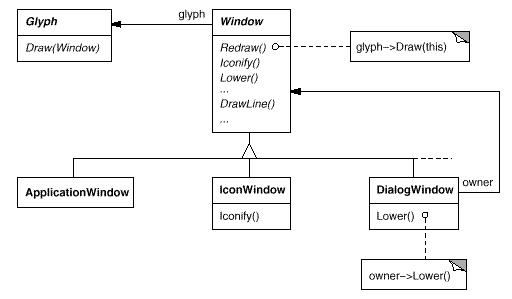
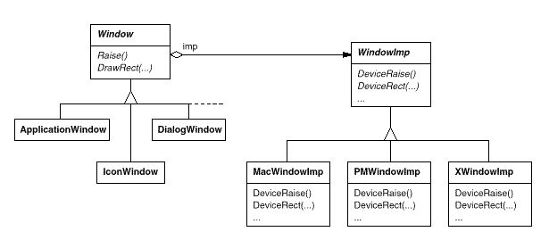

# 다중 윈도우 시스템 지원
룩앤필은 이식성을 생각할 때 불거지는 수많은 문제 중 하나일 뿐입니다. 또 다른 문제는 Lexi가 실행되는 윈도우 환경입니다. 보통 한 플랫폼에서 운영되는 윈도우 시스템은 비트맵 디스플레이에서 윈도우를 만들어 내고, 윈도우 화면 위의 공간을 관리하며, 키보드나 마우스에서 받은 입력을 윈도우에 전달합니다. 현실적으로, 우리가 자주 사용하는 대부분의 윈도우 시스템은 서로 호환성이 없습니다(예를 들어, 매킨토시, 프레젠테이션 매니저, Windows, X). Lexi는 여러 룩앤필 표준을 지원한다는 똑같은 명분이 있으므로, 가능하면 여러 윈도우 시스템에서 실행되었으면 합니다.
## 추상 팩토리 패턴을 사용할 수 있을까요?
먼저 생각해 볼 수 있는 것이, 앞에서 이야기한 추상 팩토리 패턴을 사용할 수 있을까 하는 문제입니다. 윈도우 시스템 간의 이식성은 앞에서 본 룩앤필 표준에 대한 독립성과는 사뭇 다른 점이 있습니다.

추상 팩토리 패턴을 적용할 때는 각 룩앤필 별로 정확한 위젯 클래스를 정의할 것이라고 가정했습니다. 이 말은 특정 표준별로 추상 제품 클래스에서 각각 구체적인 제품을 만들 수 있다는 것이며, `ScrollBar` 클래스가 있으면 표준별로 `MotifScrollBar` 클래스와 `MacScrollBar` 클래스를 만들 수 있음을 의미합니다. 즉, 각 위젯별로 하나의 추상 클래스를 추출할 수 있어 추상 팩토리 패턴의 사용이 가능합니다. 윈도우 시스템은 각 회사마다 서로 다른 여러 개의 클래스 계층을 이미 가지고 있는데, 이 계층이 서로 호환 가능하다고 볼 수 없기 때문에 각각 위젯별로 공통의 추상 클래스를 정의할 수 없습니다. 다시 말해, `ScrollBar`, `Button`, `Menu` 같은 각 위젯에 대해서 하나의 `Product`라는 클래스를 정의할 수 없다는 것입니다. 이때는 추상 팩토리 패턴을 적용할 수 없으므로, 제품이 갖는 인터페이스에서 공통된 연산을 정의하는 별도의 위젯 계층을 만들어야 합니다.

추상 팩토리 클래스의 인터페이스에 선언할 수 있는 공통의 연산이라면 그것은 `CreateXXX()` 연산일 것입니다. 이 말은 위젯들 간에 호환성을 위해서 우리 나름대로 추상 클래스와 구체적인 제품 클래스 모두를 만들어야 한다는 의미이기도 합니다.

허나, 그래도 다행인 점은 룩앤필 표준에서도 그랬듯이 윈도우 시스템의 인터페이스 역시 심각하게 다르지 않다는 것입니다. 윈도우 시스템이 하는 일이 비슷비슷하기 때문입니다. 단, 하는 일은 비슷하지만 구현하는 방법은 완전히 다르므로 윈도우가 하는 일에 대한 추상화와 이를 구현하는 방법의 추상화를 분리시켜야 합니다. 윈도우가 하는 일이란 윈도우 시스템의 인터페이스를 의미하고, 이를 구현하는 방법이란 실제 윈도우 시스템이 제공하는 프로그래밍 인터페이스를 의미합니다. 즉, 해야 하는 일들은 비슷하지만, 이를 만족하는 구체적인 방법이 서로 다를 수 있기 때문에, 이 둘을 분리하자는 것입니다.

## 구현 종속성을 캡슐화
[2.2 문서 구조](https://github.com/wonder13662/my-books/blob/writing/GOF-design-patterns/Chapter02/2-2.md)에서 화면에 표시되는 글리프나 글리프 구조를 위한 Window 클래스를 선보인 바 있습니다. 그러나 이들 객체가 동작할 윈도우 시스템을 명시하지는 않았습니다. 왜냐하면 Window 클래스는 어떤 특정 윈도우 시스템에서 얻어온 개념이 아니라 전체 윈도우 시스템 전반에 걸쳐서 하는 일을 추상화한 것이기 때문입니다. 즉, 이 클래스는 서로 다른 윈도우 시스템에서 공통적으로 수행하는 다음과 같은 것들을 캡슐화합니다.
- 기본적인 기하학적 도형을 그릴 수 있는 연산을 제공합니다. 
- 아이콘 상태가 될 수도 있고 아이콘 상태에서 해제될 수도 있습니다.
- 크기 변경이 가능합니다. 
- 요청이 있을 때 콘텐츠를 (다시) 그립니다. 이를테면, 아이콘에서 원상 복구되거나 중첩된 부분이 화면에 보일 때 다시 작성하는 것입니다.
Window 클래스는 윈도우 시스템과 상관없이 서로 다른 윈도우 시스템에서 기능성을 확장할 수 있습니다. 이를 위한 다음 두 가지의 극단적인 원칙을 검토해 봅시다.

1. 기능성의 교집합으로만 인터페이스를 정의
   - Window 클래스의 인터페이스는 모든 시스템에 공통되는 기능성만을 연산으로 정의합니다. 이 방법의 문제는 최소한의 기능을 제공하는 윈도우 시스템에서만 Window 인터페이스의 기능을 사용할 수 있습니다. 모든 윈도우 시스템이 갖는 공통의 연산만을 인터페이스로 정의한다면, 전부는 아니더라도 대부분의 윈도우 시스템이 제공하는 고급 기능들은 사용할 수 없습니다.
2. 기능성의 합집합으로만 인터페이스를 정의
   - 기존에 존재하는 모든 시스템이 갖고 있는 기능들을 모두 인터페이스에 정의하는 방법입니다. 이 방법의 문제는 인터페이스가 너무 크고 응집력이 없다는 점과 제조사가 윈도우 시스템의 인터페이스를 개정할 때마다 우리의 인터페이스도 변경해야 한다는 점 입니다.
### 표 2.3
#### Window 클래스의 인터페이스
|책임|연산|
|---|---|
|윈도우 관리|virtual void Redraw()<br>virtual void Raise()<br>virtual void Lower()<br>virtual void Iconify()<br>virtual void Deiconify()<br>...|
|그래픽 처리|virtual void DrawLine(...)<br>virtual void DrawRect(...)<br>virtual void DrawPolygon(...)<br>virtual void DrawText(...)<br>...|

이 두 방법은 모두 문제가 있기 때문에, 그 중간 방법을 선택해야 할 것입니다. Window 클래스는 대부분의 윈도우 시스템이 제공하는 기능을 인터페이스로 제공합니다. Lexi가 Window 클래스를 직접 다루므로 Window 클래스는 Lexi가 알고 있는 글리프들을 모두 지원해야 합니다. 다시 말해, Window의 인터페이스는 글리프 자체를 윈도우에 그리는 연산들을 전부 포함해야 한다는 것입니다. [표 2.3](https://github.com/wonder13662/my-books/blob/writing/GOF-design-patterns/Chapter02/2-6.md#%ED%91%9C-23)에 Window 클래스에 정의할 인터페이스를 정리하였습니다. 



Window는 추상 클래스이고 Window를 상속하는 서브클래스들이 사용자가 다룰 서로 다른 종류의 윈도우를 지원합니다. 예를 들어, Window 서브클래스는 응용프로그램 윈도우, 아이콘, 경고 창 등 다양한 종류의 윈도우를 지원합니다. 그러므로 ApplicationWindow, IconWindow, DialogWindow 등 서브클래스에서 윈도우들 간의 차이를 소화할 수 있게 됩니다. 이런 의미를 포함한 클래스 계층을 만들어 보면 위의 그림과 같습니다.

이렇게 정의한 Window 인터페이스로 실제 플랫폼에 종속적인 윈도우를 만들 수 있을까요? 우리만의 윈도우 시스템을 따로 구현하는 것이 아니라면, 윈도우 추상화는 반드시 기존의 윈도우 시스템이 제공하는 방법으로 구현되어야 합니다. 그렇다면 이들 구현은 어떻게 정의되어야 할까요?

(1)한 가지 방법은, Window 클래스와 서브클래스들을 각각 윈도우 플랫폼마다 서로 다른 버전으로 구현하는 것입니다. 즉, 각 윈도우 플랫폼별로 다른 버전을 갖게 하는 것입니다. 그리고 Lexi를 구축할 때 사용할 플랫폼 버전을 선택합니다. 그러나 이때는 유지보수가 매우 어렵습니다. 개발자 쪽에서는 여러 클래스를 모두 관리해야 하는데, 이것은 서로 다른 구현 시스템에서 작동하지만 이름은 전부 똑같이 'Window'입니다. 더구나 유지보수 대상을 식별하기도 어려울 것입니다. (2)또 다른 방법은 Window 계층의 각 클래스에 대해 구현 플랫폼별 서브클래스를 모두 생성하는 것입니다. 하나의 IconWindow 클래스 아래 MotifIconWindow, PMIconWindow,... 이런 식으로 플랫폼별 클래스를 만드는 것인데, 이 방법을 쓸 때에는 서브클래스의 수가 너무 많아진다는 문제가 발생합니다. 그리고 방금 말씀드린 두 방법은 공통적인 또 다른 단점을 가지고 있습니다. 프로그램을 컴파일한 후에는 윈도우 시스템을 변경할 수 없다는 것이 그 단점입니다. 결국 윈도우 시스템마다 별도의 실행 파일을 유지할 수 밖에 없습니다.

두 방법 모두 매력적이지 않다면 어떤 다른 방법이 있을까요? 서식 설정이나 장식을 설계할 때 썼던 방법처럼, **다양성이 존재하는 부분을 별도로 캡슐화**하면 됩니다. 이 때 다양성을 갖는 대상은 윈도우 시스템별 구현입니다. 윈도우 시스템의 기능을 하나의 인터페이스 객체로 캡슐화했다면 우리는 Window 클래스와 이의 서브클래스를 구현할 때 이 인터페이스를 따라서 구현해야 합니다. 이 인터페이스가 우리가 관심있는 모든 윈도우 시스템을 지원할 수 있다면 다른 윈도우 시스템을 지원하기 위해서 이 인터페이스를 변경할 필요는 없습니다. 윈도우 객체와 윈도우 시스템 사이의 연결 관계를 설정하는 것도 간단합니다. 적절한 윈도우 시스템을 캡슐화한 객체를 윈도우 시스템 쪽으로 전달해 주면 됩니다. 심지어 런타임에도 윈도우를 설정할 수 있습니다.
## Window와 WindowImp
서로 다른 윈도우 시스템 구현을 숨기기 위해 **WindowImp** 클래스 계층을 정의하려고 합니다. WindowImp는 추상 클래스이고, 윈도우 시스템에 종속된 코드를 캡슐화합니다. Lexi가 특정 윈도우 시스템에서 제대로 동작하도록, 각 윈도우 객체를 WindowImp의 서브클래스 인스턴스로 설정할 것입니다. 다음 다이어그램은 Window 클래스와 WindowImp 클래스 간의 관계를 보여줍니다.



윈도우 시스템 구현이 WindowImp 클래스 속으로 숨어 들어갔기 때문에, 이제는 Window 클래스를 윈도우 시스템에 종속적인 내용으로 더럽히지 않아도 됩니다. 이로써 Window 클래스 계층은 비교적 작아졌으며 외부 변화에도 안정성을 유지할 수 있게 되었습니다. 그뿐만 아니라 새로운 윈도우 시스템을 지원하기 위해 구현 계층을 확장하는 것도 쉬워졌습니다.

## WindowImp 서브클래스들
WindowImp 서브클래스들은 처리 요청을 받아서 이를 실제 윈도우 시스템이 정의하고 기존 연산을 이용하여 구현합니다. 윈도우에 사각형을 그리는 상황을 예를 들어 봅시다. `Rectangle::Draw()` 연산의 구현을 보면, 실제 `Draw()`를 수행하기 위해 매개변수로 받은 Window 인스턴스에 정의된 `DrawRect()` 연산을 호출합니다. 
```c++
void Rectangle::Draw (Window* w) {
   w->DrawRect(_x0, _y0, _x1, _y1);
}
```
Window 클래스에 정의한 `DrawRect()` 연산의 기본 구현 방법은 다음 코드에서 알 수 있듯이 WindowImp 클래스의 인스턴스가 제공하는 사각형을 그릴 수 있는 `DeviceRect()` 연산을 호출합니다.
```c++
void Window::DrawRect (
   Coord x0, Coord y0, Coord x1, Coord y1
) {
   _imp->DeviceRect(x0, y0, x1, y1);
}
```
_imp는 Window의 멤버 변수로서, WindowImp 인스턴스에 대한 참조자입니다. 윈도우 구현은 WindowImp 서브클래스의 인스턴스가 제공하는 것입니다. 예를 들어, XWindowImp가 구현한 `DeviceRect()`의 코드를 보면 다음과 같습니다.
```c++
void XWindowImp::DeviceRect (
   Coord x0, Coord y0, Coord x1, Coord y1
) {
   int x = round(min(x0, x1));
   int y = round(min(y0, y1));
   int w = round(abs(x0 - x1));
   int h = round(abs(y0 - y1));
   XDrawRectangle(_dpy, _winid, _gc, x, y, w, h);
}
```
`XDrawRectangle()` 연산은 왼쪽 모서리, 넓이, 높이로 사각형을 정의하기 때문에 `DeviceRect()` 연산이 넘겨받은 매개변수를 이용하여 모서리 좌표, 넓이, 높이를 구한 후 `XDrawRectangle(...)`을 호출합니다. x0, y0을 왼쪽 아래 모서리의 좌표로 가정하고 넓이와 높이를 구해서 _dpy, _winid, _gc, x, y, w, h의 매개변수를 만들었습니다.

PMWindowImp는 프레젠테이션 매니저용 WindowImp 서브클래스로, `DeviceRect()` 연산의 구현 방법이 XWindowImp 클래스에 정의한 것과 다릅니다.
```c++
void PMWindowImp:DeviceRect (
   Coord x0, Coord y0, Coord x1, Coord y1
) {
   Coord left = min(x0, x1);
   Coord right = max(x0, x1);
   Coord bottom = min(y0, y1);
   Coord top = max(y0, y1);

   PPOINTL point[4];
   point[0].x = left;   point[0].y = top;
   point[1].x = right;   point[1].y = top;
   point[2].x = right;   point[2].y = bottom;
   point[3].x = left;   point[3].y = bottom;

   if (
      (GpiBeginPath(_hps, 1L) == false) ||
      (GpiSetCurrentPosition(_hps, &point[3]) == false) ||
      (GpiPolyLine(_hps, 4L, point) == GPI_ERROR) ||
      (GpiEndPath(_hps) == false)
   ) {
      // 오류 출력
   } else {
      GpiStrokePath(_hps, 1L, 0L);
   }
}
```
왜 X 윈도우 시스템 버전과 다른 것일까요? 프레젠테이션 매니저는 X 윈도우와 달리 사각형을 그리는 연산을 정의하지 않고 대신 다각형의 꼭지점을 이용해서 테두리를 만들고 그 안을 꽉 채우는 방식을 택하기 때문입니다. 

PM의 `DeviceRect()` 구현은 X 윈도우 시스템과는 완전히 다르지만, 별 문제가 되지않습니다. WindowImp 클래스는 이러한 시스템 인터페이스의 가변성을 안정적인 인터페이스 뒤에 숨기고 있기 때문입니다. 이 때문에 각 서브클래스를 작성할 때는 윈도우 추상부만 신경 쓰면 되고, 윈도우 시스템의 세부 사항까지는 신경 쓸 필요가 없습니다. 게다가, 새로운 윈도우 시스템을 지원하고자 할 때도 기존 Window 클래스를 건드리지 않아도 됩니다.

## WindowImp를 써서 Windows 설정하기
아직 다루지 않은 문제는 적당한 WindowImp 서브클래스의 인스턴스를 어떻게 Window 쪽에서 얻는가 하는 문제입니다. 즉, _imp 멤버 변수를 언제 초기화하고, 어떤 윈도우 시스템을 사용해야 하며, 누가 알고 있어야 하는지와 관련된 문제입니다. Window 쪽에서는 무엇인가 처리하기 전에 몇 종류의 WindowImp 클래스가 필요하다는 것은 자명한 사실입니다. 

몇 가지 해결 방법이 있지만, 여기서는 추상 팩토리 패턴을 사용하는 방법만 살펴보겠습니다. 먼저, WindowSystemFactory 클래스를 만들어서 윈도우 시스템별 구현 객체의 각 종류를 생성하는 인터페이스를 정의합니다.
```c++
class WindowSystemFactory {
   public:
      virtual WindowImp* CreateWindowImp() = 0;
      virtual ColorImp* CreateColorImp() = 0;
      virtual FontImp* CreateFontImp() = 0;

      // 모든 윈도우 시스템 자원에 대한 "Create..." 연산
}
```
그러고 나서 각각의 윈도우 시스템마다 필요한 팩토리를 정의합니다.
```c++
class PMWindowSystemFactory : public WindowSystemFactory {
   virtual WindowImp* CreateWindowImp()
      { return new XWindowImp; }
   // ...
}
```
마지막으로 Window 클래스의 생성자를 손봅니다. 이 생성자 안에서 적당한 윈도우 시스템에 해당하는 WindowImp 클래스 인스턴스로 _imp 멤버 변수를 초기화할 때 `WindowSystemFactory` 클래스의 `CreateWindowImp()` 연산을 이용합니다.
```c++
Window::Window () {
   _imp = windowSystemFactory->CreateWindowImp();
}
```
`windowSystemFactory` 인스턴스는 WindowSystemFactory 서브클래스의 인스턴스로, 앞 절에서 룩앤필 문제를 해결했을 때 등장한 `guiFactory` 인스턴스에 해당하는 개념입니다. 그러므로 이 `windowSystemFactory` 인스턴스의 초기화는 `guiFactory`와 동일하게 진행할 수 있습니다.
## 가교패턴
WindowImp 클래스는 윈도우 시스템 특성에 공통인 인터페이스를 정의하지만, 이를 설계할 때 받는 제약은 Window 인터페이스와 다릅니다. 응용프로그램 프로그래머는 WindowImp 인터페이스를 직접 사용하지 않고 Window 객체만을 이용하므로, WindowImp 인터페이스는 응용프로그램 프로그래머가 바라보는 윈도우의 개념과 일치할 필요는 없습니다. 프로그래머가 바라보는 윈도우의 개념은 Window 클래스 계층에 정의하지만, WindowImp 인터페이스는 실제 윈도우 시스템이 제공하는 인터페이스에 종속됩니다.

중요한 것은, Window 인터페이스는 응용프로그램 프로그래머가 만족하는 것이어야 하고, WindowImp 인터페이스는 실제 윈도우 시스템의 특성과 맞아야 한다는 점입니다. 윈도우의 기능을 Window 클래스와 WindowImp 클래스로 구분함으로써 이 두 클래스를 독립적으로 구현하고 확장할 수 있습니다. 두 계층에 속한 객체들이 함께 맞물려 돌아가면서 Lexi는 다양한 윈도우 시스템에서도 수정없이 동작할 수 있습니다.

Window 클래스와 WindowImp 클래스 간의 관련성은 [가교 패턴]()의 한 예입니다. 서로 독립적으로 확장되지만 함께 동작해야 하는 개념들을 별도의 클래스 계층으로 분리하는 것이 가교 패턴의 목적입니다. 이렇게 두 개의 계층으로 분리할 때는 두 가지의 기준을 세워야 합니다. 하나는 논리적 개념에 해당하는 윈도우이고, 다른 하나는 그 윈도우에 대한 서로 다른 물리적인 구현입니다. 가교 패턴을 적용하면, 윈도우 시스템에 종속적인 구현과 전혀 상관없이 논리적인 윈도우 추상화를 확장할 수 있고, 그 반대로 추상적 개념과 무관하게 새로운 윈도우 시스템의 구현도 추가할 수 있습니다.