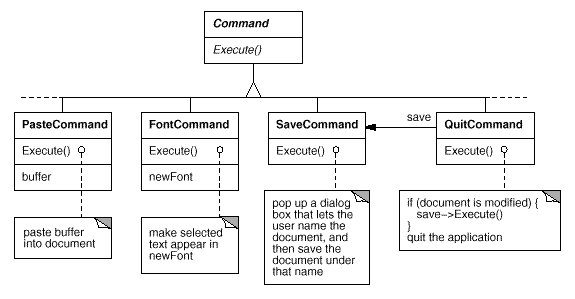
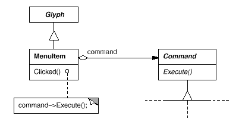
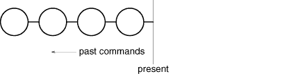

# 2.7 사용자 조작
Lexi가 제공하는 기능 중 일부는 WYSIWYG 특성을 통해 실행되도록 되어 있습니다. 즉, 텍스트를 입력,삭제하며, 삽입 지점으로 커서를 이동하고 텍스트의 범위를 선택하는 기능은 문서 화면을 마우스로 직접 클릭하고 키보드로 타이핑함으로써 기능합니다. 또 어떤 기능들은 Lexi의 풀다운 메뉴나 버튼, 키보드를 통해서 사용할 수 있습니다. 그 기능들을 정리해 보면 다음과 같습니다.

- 새로운 문서 생성
- 기존 문서를 열고, 저장하며, 출력하기
- 문서의 일부 영역을 자르고 붙이기
- 선택한 텍스트의 글꼴 바꾸기
- 문단 정렬 같은 텍스트 편집
- 응용프로그램 종료
- 기타

앞에서 열거한 기능을 처리하기 위해서 Lexi는 특별한 사용자 인터페이스를 제공합니다. 허나, 이런 사용자 조작을 어느 특정 사용자 인터페이스에만 국한시키고 싶지는 않습니다. 왜냐하면 여러 개의 사용자 인터페이스가 동일한 연산을 수행할 수도 있기 때문입니다. 예를 들어, 페이지를 바꾸기 위해서 메뉴를 이용할 수도 있고, 페이지 이동 버튼을 이용할 수도 있습니다. 또한 앞으로 인터페이스를 변경할 기회는 많을 것입니다. 그럴 때마다 사용자 조작 기능이 바뀌는 것은 아닙니다.

게다가, 한 가지의 조작 기능은 여러 다른 클래스들에서 구현됩니다. 그렇기 때문에 필자, 즉 구현자 쪽에서는 이런 기능을 위해 구현과 사용자 인터페이스 클래스 사이에 종속성을 만드는 일은 하지 않으려고 합니다. 결합도가 강한 구현을 만들게 되면 이해하기도 어렵고 확장이나 유지보수가 어려워지기 때문입니다.

더 복잡한 문제로, Lexi는 재실행(redo)과 취소(undo) 기능(8)을 제공했으면 좋겠습니다. 특히 삭제와 같은 수정 조작에 대해서 취소할 수 있었으면 합니다. 그러나 저장이나 종료의 조작을 취소할 수는 없습니다. 그리고 실행과 취소가 되는 단계에 제한을 두고 싶지도 않습니다.

웬만한 응용프로그램들은 이 정도의 기능들을 모두 지원합니다. 따라서 여기서는 이러한 요구를 모두 만족시킬 수 있는 간단하면서도 확장 가능한 메커니즘을 만드는 것을 목표로 삼아봅니다.

(8) 방금 수행한 것을 취소하는 연산입니다.
## 요청의 캡슐화
설계자의 관점에서 보면 풀다운 메뉴도 특별한 것이 아닙니다. 그저 다른 글리프를 포함하는 또 다른 글리프일 뿐입니다. 단지 풀다운 메뉴가 다른 글리프와 구별되는 점은, 풀다운 메뉴를 구성하는 요소들은 사용자 선택에 반응을 보이기 위해서 어떤 일을 수행해야 한다는 것입니다.

이런 일을 수행하는 글리프를 **MenuItem** 클래스의 인스턴스로 가정합시다. 이 MenuItem 클래스는 Glyph 클래스의 서브클래스로 둡니다. MenuItem 클래스는 사용자(9) 요청에 대한 반응으로 자신이 처리해야 할 일을 수행합니다. 처리를 수행한다는 것은 한 객체에 대한 연산을 포함하거나 많은 객체에 걸쳐서 여러 연산을 수행한다는 것을 의미합니다.

(9)개념적으로, 사용자는 Lexi의 사용자입니다. 그러나 실제로는 사용자로부터 들어온 입력을 관리하는 또 다른 객체입니다.(이벤트 디스패처(event dispatcher)와 같습니다)

마음만 먹으면, 모든 사용자 조작에 대한 연산을 MenuItem 서브클래스로 정의하고 각각의 요청을 처리하도록 서브클래스에 하드코딩할 수도 있었습니다. 그러나 이건 아니라고 생각했습니다. 풀다운 메뉴에 있는 각 메뉴 항목 문자열마다 서브클래스를 달아둘 필요가 없는 것처럼 각 요청별로 서브클래스를 정의할 필요는 없는 것이죠. 게다가, 이 방법을 사용하면, 특정한 사용자 인터페이스 클래스와 요청을 결합하는 결과를 낳기 때문에, 다른 사용자 인터페이스를 통해서 동일한 요청을 처리하려고 할 때 난감해집니다.

문서의 마지막 페이지로 이동하는 데에 풀다운 메뉴의 MenuItem을 이용할 수 있고 동시에 Lexi의 인터페이스 하단부에 있는 페이지 아이콘을 누를 수 있다고(짧은 문서라면 이게 더 편리하겠지요) 가정합시다. 상속을 써서 각 MenuItem과 요청을 연결해 둔 상태라면, 페이지 아이콘 및 이런 요청을 발생시키는 다른 위젯에 대해서도 똑같은 작업을 해주어야 합니다. 이렇게 하면 필요한 클래스의 수는 위젯의 종류 수에 요청의 수를 곱한 것이 됩니다.

아참, 빠뜨릴 뻔 했군요. 메뉴 항목이 처리할 요청으로 메뉴 항목을 매개변수화하는 매커니즘이 있을 수도 있습니다. 이 방법을 이용하면 서브클래스의 확산을 막을 수 있을 뿐만 아니라 프로그램 실행 중 유연성도 높일 수 있습니다. 호출할 함수로 MenuItem 클래스를 매개변수화할 수도 있겠지만, 이것도 다음 세 가지 이유 때문에 완벽한 해법이 되지는 못합니다.

1. 실행/취소 문제를 처리할 수 없습니다.
2. 함수에 상태를 결합시키기 어렵습니다. 예를 들어, 폰트를 바꾸는 함수는 어떤 폰트인지부터 알아야 합니다.
3. 함수를 확장하기 어렵고, 함수의 일부를 재사용하기도 쉽지 않습니다.

#### 그림 2.11 Command 클래스 계통의 일부

이런 이유로, 여기서는 함수를 매개변수로 받는 것이 아니라 객체를 MenuItem 매개변수로 정의하려 합니다. 이렇게 하면, 상속을 통해서 요청 구현을 확장하거나 재사용할 수 있습니다. 게다가, 실행/취소 서비스를 구현할 수 있고 상태를 저장할 수 있는 공간을 객체 안에 정의할 수도 있습니다. 여기에 다양화될 수 있는 개념, 즉 요청을 캡슐화하는 것에 대한 또 다른 예제가 등장합니다. 이제 이 각각의 요청을 **명령**(command) 객체 안에 캡슐화하는 것을 보여주려고 합니다.

## Command 클래스와 서브클래스
먼저, 요청을 발생시키는 인터페이스를 제공하기 위해 **Command** 추상 클래스를 정의합니다. 이 인터페이스는 요청 발생용 인터페이스의 기본으로, "Execute" 추상 연산 하나만 있습니다. Command 클래스의 서브클래스는 다른 요청의 수행을 위해 서로 다른 방식으로 `Execute()` 연산을 구현하는 것입니다. 이때, 어떤 서브클래스는 다른 객체에 작업의 일부나 전체를 위임할 수도 있고, 다른 서브클래스는 자신만의 방식으로 요청을 처리할 수도 있습니다(그림 2.11을 참고하세요). 하지만 요청자 쪽에서 보는 Command 객체는 그냥 Command 객체일 뿐입니다. 그저 똑같이 취급된다는 뜻입니다.

#### 그림 2.12 MenuItem-Command 사이의 관계

이제 MenuItem 클래스는 요청을 캡슐화한 Command 객체를 저장할 수 있습니다(그림 2.11을 참고하세요). 각 메뉴 항목 객체는 해당 메뉴 항목에 맞는 Command 서브클래스 인스턴스를 가질 수 있습니다. 마치 메뉴 아이템별로 화면에 표시될 글자를 갖는 것처럼 말이죠. 사용자가 특정 메뉴 항목을 선택하면 MenuItem 클래스는 Command 객체의 `Execute()` 연산을 호출하는 것만으로도 요청 수행을 간단히 마칩니다. 버튼과 다른 위젯들도 이와 동일한 방식으로 명령들을 처리한다는 점도 주목할 부분입니다.

## 취소 가능성
실행/취소는 대화식 응용프로그램에서 중요한 기능입니다. 명령을 실행하고 취소하기 위해서는 Command 인터페이스에 `Unexecute()` 연산을 추가해야 합니다. `Unexecute()` 연산은 이 정보를 이용해서 해당 범위의 텍스트를 원래 폰트로 되돌립니다.

가금 이런 취소 가능성(undoability)을 런타임에 결정해야 할 때도 있습니다. 즉, 폰트를 변경한 부분이 이미 이전 폰트와 동일하다면 어떤 변경도 일어나지 않습니다. 사용자가 몇 글자를 선택하고 가짜로 폰트 변경을 요청했다고 생각해 봅시다. 즉, 현재와 동일한 폰트로 변경해 달라고 한 것입니다. 이때, 취소를 하면 어떤 결과가 만들어질까요? 이와 같은 의미 없는 변경을 처리할 때도 또 다시 의미 없는 무엇인가를 취소해야 할까요? 아마도 그렇게 할 필요는 없을 것입니다. 사용자가 여러번 이와 같은 장난스런 폰트 변경을 계속한다면 동일한 수만큼 취소하지 않아야 됩니다. 명령을 수행한 후 나타난 결과에 어떠한 영향도 미치지 못했다면 해당 취소 명령도 수행할 필요가 없습니다.

그러므로 명령이 취소 가능한 것인지 아닌지를 판단하기 위해서는 Command 인터페이스에 `Reversible()` 연산을 추가해야 합니다. `Reversible()` 연산은 불린(boolean) 값을 반환하는 연산으로, 각 서브클래스에서 이 연산이 취소 가능한지 아닌지를 판단하여 참 또는 거짓을 반환하도록 재정의할 수 있습니다.

## 명령 이력
실행과 취소를 임의 수준으로 지원하도록 만드는 작업의 마지막 단계는 **명령 이력**(command history)을 정의하는 것입니다. 즉, 실행한(취소된 명령이 있을 때에는 실행이 취소된) 명령의 리스트를 관리하는 것입니다. 개념적인 모습은 다음과 같습니다.

동그라미 하나는 명령어 객체 한 개를 나타냅니다. 위의 그림에서 사용자는 네 개의 명령을 내린 것입니다. 가장 왼쪽에 있는 명령어가 제일 먼저 수행한 것이고, 그 다음 순으로 수행한 것입니다. "present"가 표시된 수직선은 가장 최근에 수행한(혹은 취소한) 명령을 유지합니다.

가장 최근의 명령을 취소하려면 가장 최근의 명령 객체에 대해 `Unexecute()`를 호출하면 됩니다.

명령을 취소하고 나면 "present" 선이 하나 앞에 있는 명령어, 즉 왼쪽 옆에 있는 명령어로 이동합니다. 사용자가 다시 취소를 선택하면 다음번 최근에 수행한 명령을 취소하고 다시 왼쪽으로 이동합니다.

이렇게 반복하면 여러 번 취소할 수 있고, 횟수는 명령 이력의 길이에 의해서만 제한을 받게 됩니다.

명령을 다시 수행시키고 싶다면 반대로 처리하면 됩니다. present 선 오른쪽에 있는 명령어가 앞으로 재수행할 명령 객체입니다. 가장 최근에 취소된 명령어를 다시 수행하려면 present 선 오른쪽에 있는 명령 객체에서 `Execute()` 연산을 호출하면 됩니다.

이렇게 되면 present 선이 오른쪽으로 이동하게 되고 연이은 재실행은 다음번 명령 객체를 다시 실행하게 합니다.

물론, 연이은 연산이 재실행이 아니라 취소일 때는 present 선 왼쪽에 있는 명령어 객체를 취소하면 됩니다. 이를 통해, 사용자는 자신의 실수를 복구하기 위해 필요하다면 취소와 실행을 적절한 시기에 효과적으로 오갈 수 있습니다.

## 명령 패턴
Lexi의 사용자 명령어는 명령 패턴을 응용한 것으로, 명령 패턴은 요청을 어떻게 캡슐화하는지 설명하는 패턴입니다. 명령 패턴은 요청을 발생시키는 데 필요한 균일한 인터페이스를 규정해 주기 때문에, 사용자 쪽에서는 서로 다른 요청을 동일하게 처리할 수 있습니다. 명령 패턴으로 만들어진 인터페이스는 요청 처리의 구현 내용을 사용자에게 숨깁니다. 하나의 명령(객체)은 요청의 구현을 전부 또는 일부 다른 객체에 위임할 수 있고, 전혀 위임하지 않고 자신이 처리할 수도 있습니다. 이런 특성은 Lexi처럼 여러 부분에 흩어진 기능을 한 곳에 집중하여 접근할 수 있도록 해야 하는 응용프로그램에서는 완벽한 해법이 될 수 있습니다. 또한, 이 패턴에는 취소와 재실행을 처리하는 인터페이스를 추가할 수도 있습니다.