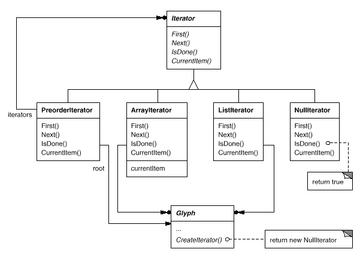
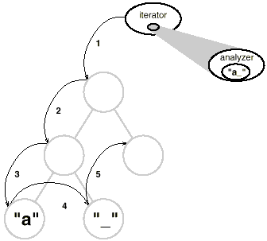
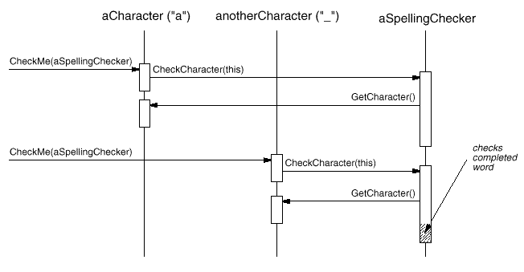
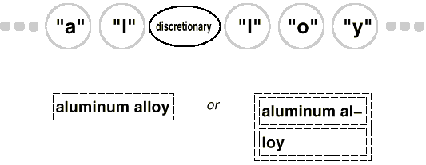

# 2.8 철자 검사 및 붙임표 연결
마지막 설계 문제는 텍스트 분석입니다. 여기서는 철자 오류 검사, 그리고 보기 좋은 편집을 위한 붙임표 삽입에 대한 해결책을 찾아보겠습니다.

여기서 제약 사항은 [2.3 서식 설정](https://github.com/wonder13662/my-books/blob/writing/GOF-design-patterns/Chapter02/2-3.md)에서 서식 설정 문제를 해결할 때의 제약과 비슷합니다. 라인 분리자 전략에서도 그랬지만, 철자 검사와 붙임표 위치를 구하는 방법은 한두가지가 아닙니다. 그래서 여기서도 우리는 다양한 알고리즘을 지원하고 싶습니다. 다양한 알고리즘이 있다면 공간, 시간, 품질에 따른 선택의 폭을 사용자에게 제공할 수 있습니다. 마찬가지로, 새로운 알고리즘 추가도 쉬워야 할 것입니다.

이와 더불어, 문서 구조 안에는 이러한 기능이 엮여 들어가지 않았으면 좋겠습니다. 지금 이 목표는 서식 설정 문제를 처리할 때 있었던 목표보다 더 중요한데, 그 이유는 철자 검사나 붙임표 지점 설정 기능은 Lexi가 제공했으면 하고 바라는 다양한 분석 기법 중 일부분이기 때문입니다. 이런 텍스트 분석 기능은 확실히 확장이 필요합니다. 탐색, 단어 갯수 세기, 테이블의 값 합산 등 계산 기능, 문법 검사 등 다양한 기능이 계속적으로 추가될 수 있는 틀을 만들고 싶은 것 입니다. 그러나 이런 기능을 추가할 때마다 Glyph 클래스나 이를 상속하는 서브클래스들을 변경하고 싶지는 않습니다.

이 퍼즐을 풀려면 두 가지 조각을 맞추면 됩니다. 
1. 분석될 정보에 접근하는 것인데, 이 정보는 문서 구조를 나타내는 여러 글리프에 흩어져 있습니다.
2. 분석을 직접하는 것입니다.
이 두 문제를 각각 따로 살펴보도록 합시다.

## 흩어진 정보에 대한 접근
전부는 아니지만 대다수 분석 작업에서는 글자 단위의 분석이 필요합니다. 우리가 분석해야 하는 텍스트는 글리프 객체의 계층 구조에 흩어져 있습니다. 이런 구조에서 텍스트를 검사하려면 객체를 저장하고 있는 데이터 구조에 대한 지식이 있어야 합니다. 이런 계층 구조를 연결 리스트로 저장해 두었을 수도 있고, 배열로 만들어졌을 수도 있고, 아니면 또 다른 복잡미묘한 구조일 수도 있습니다. 어쨌든, Lexi에서 쓰는 정보 접근 방법은 이런 모든 가능성을 처리할 수 있어야 합니다.

여기에 딸린 복잡한 문제가 하나 더 있는데, 바로 분석 방법마다 정보에 접근하는 방법이 제각기 다르다는 것입니다. 대부분의 분석은 텍스트를 앞에서 뒤로 분석해가지만, 어떨 때는 반대로 할 수도 있습니다. 산술 표현식을 평가할 때는 중위 순회(inorder traversal) 방법을 써야 합니다.

결론은 두 가지입니다. Lexi에서 쓰는 접근 방법은 서로 다른 데이터 구조를 포괄살 수 있어야 하며, 서로 다른 순회 방법(후위(postorder), 중위(inorder), 전위(preorder) 등)이 지원되어야 합니다.

## 접근과 순회 방법을 캡슐화하기
현재의 Glyph 인터페이스는 자식들을 참조하는 데에 정수형 지정번호를 사용합니다. 자식을 배열에 저장한 글리프 클래스에 대해서는 이런 방식이 타당합니다만, 연결 리스트를 사용하는 글리프 클래스에서라면 효율이 좋지 않을 것입니다. 글리프 추상화의 가장 큰 의의는 자식들을 저장하는 자료 구조를 외부에 숨기는 것이었습니다. 이렇게 해야만 다른 클래스에 영향을 주지 않고 자료 구조를 마음대로 변경할 수 있습니다.

그러므로 글리프는 단지 데이터 구조를 사용한다는 것만 알 뿐, 무슨 데이터 구조를 사용하는지는 몰라야 한다는 것입니다. 이를 위해서 어떤 데이터 구조에도 치우치지 않는 인터페이스를 정의해야 합니다. 즉, 인터페이스를 보고 글리프가 사용하는 데이터 구조가 무엇인지를 판단할 수 있으면 안 됩니다.

이런 문제를 해결하면서 한번에 다양한 순회 방뻐을 제공하는 방법은 여러가지 입니다. 이들 중, 글리프들의 클래스에 접근과 순회 기능을 다양하게 구현하고 이 중 하나를 선택하게 하는 방법을 생각해 볼 수 있습니다. 클래스는 순회 방법이나 접근 방법을 나타내는 나열형(enumerated) 값 중 하나를 선택해서 연산의 매개변수로 전달합니다. 동일한 종류의 순회를 수행하고 있음을 확인하기 위해서 순회동안 내내 접근 방법을 매개변수로 전달해야 합니다. 또한 순회를 진행하는 동안 축적된 정보를 계속 전달해야 합니다.

이 방법을 지원하기 위해, Glyph 인터페이스에 다음 추상 연산을 추가합니다.
```c++
void First(Traversal kind) // 나열형 값 중에서 사용할 순회 방법이나 접근 방법을 매개변수로 전달

void Next()
bool IsDone()
Glyph* GetCurrent()
void Insert(Glyph*)
```
`First()`, `Next()`, `IsDone()`은 순회를 처리하는 연산입니다. `First()`는 순회의 초기화를 맡는데, 초기화할 때 순회의 종류를 매개변수로 받고 있습니다. 여기서 `Traversal` 타입은 순회의 종류를 상수로 정의한 나열형 타입입니다. 예를 들어, 자식만 순회하는 `CHILDREN`, 전위 순회에 해당하는 `PREORDER`, 후위 순회에 해당하는 `POSTORDER` 중위 순회에 해당하는 `INORDER` 등이 나열형 값으로 들어갑니다. `Next()` 연산은 순회 순서상 다음 요소로 이동하는 것이고, `IsDone()`은 이 이상 순회할 요소가 더 있는지 없는지를 알려줍니다. `GetCurrent()` 연산은 현재 글리프로 접근하는 연산입니다. 이 연산은 `Child()` 연산으로 대체할 수도 있습니다. `Insert()`는 현재 위치에 글리프를 추가하는 연산으로, 예전에 정의한 것과 다릅니다.

전위 순회 방식을 써서 어떤 텍스트 분석 연산을 C++를 이용하여 구현하면 다음과 같습니다.
```c++
Glyph* g;
for (g->First(PREORDER); !g->IsDone(); g->Next()) {
  Glyph* current = g->GetCurrent();
  // 분석 수행
}
```
glyph 인터페이스는 이제 정수형 지정번호를 쓰지 않습니다. 예전처럼 특정 종류의 데이터 구조에 치우친 인터페이스가 아닙니다. 이렇게 되면 사용자 쪽에서 일반화된 순회 알고리즘을 구현해야 하는 노력이 많이 줄어듭니다.

그러나 이 방법에도 여전히 문제가 남아있습니다. 새로운 순회 방법을 추가하려면 나열형 값을 변경하거나 새로운 연산을 추가해야 하기 때문입니다. 전위 순회 방법을 사용하되, 문자가 아닌 것은 자동으로 넘어가는 방법을 원한다고 합시다. 이것을 위해서는 `TEXTUAL_PREORDER` 같은 상수를 `Traversal` 나열형 타입에 추가해야 합니다.

이런 식으로 기존 선언문을 바꾸는 건 별로 좋지 않을 것 같습니다. Glyph 클래스 구조에 순회 방법을 넣으면 순회 방법을 수정하거나 확장하려 할 때 반드시 여러 Glyph 클래스 서브클래스를 변경해야 할 테니까요. 그리고 다른 구조에 대해 동일한 순회 방법을 다시 사용할 수도 없고, 하나의 구조가 순회 방법을 여러 개 지니도록 만들 수도 없게 됩니다.

비슷한 이야기를 앞에서 한 것 같지만, 다양성을 지닌 개념은 하나의 클래스로 캡슐화하는 것이 좀 더 나은 해법이 될 수 있습니다. 여기서 "다양성을 지닌 개념"은 정보 접근과 순회 방법입니다. 바로 이럴 때 iterator 객체를 도입할 수 있습니다. 이 객체의 목적은 다양한 접근과 순회 방법을 일반화해서 정의하는 것입니다. 상속을 이용해서 다른 데이터 구조에 동일하게 접근할 수 있을 뿐더러 새로운 종류의 순회도 제공할 수 있습니다. 그리고 glyph 인터페이스를 변경하거나 기존 구현을 어지럽히지 않아도 됩니다.

## Iterator 클래스와 서브클래스
구조 접근과 순회에 필요한 일반 인터페이스를 정의하는 용도로 **Iterator** 추상 클래스를 사용하려고 합니다. 이 인터페이스는 **Iterator** 서브클래스 쪽에서 구현하게 되는데, 이를테면 **ArrayIterator**는 배열로 접근하고 **ListIterator**는 리스트로 접근하며, 이 외에 **PreorderIterator**, **PostorderIterator** 등은 트리 구조를 순회하는 식으로 구현될 것입니다. Iterator의 각 서브클래스는 자신이 순회할 구조에 대한 참조자를 가지며, 서브클래스의 인스턴스는 자신이 생성될 때 자신이 순회할 데이터 구조에 대한 참조자로 초기화됩니다. [그림 2.13]()은 이 관계를 보여주고 있습니다. 이러한 반복자를 지원하기 위해 Glyph 클래스 인터페이스에 추상 연산인 `CreateIterator()`를 추가해 둔 부분을 눈여겨 둡시다.


#### 그림 2.13 Iterator 클래스와 서브클래스

Iterator 인터페이스에는 순회를 제어하기 위해 `First()`, `Next()`와 `IsDone()` 연산이 있습니다. ListIterator 서브클래스는 리스트의 첫 번째 원소를 가리키도록 `First()` 연산을 구현할 것이고, `Next()` 연산은 리스트의 다음 원소로 이동하도록 구현하고, `IsDone()` 연산은 순회할 원소가 있는지 없는지를 알려주도록 구현할 것입니다. `CurrentItem()`은 Iterator 객체가 가리키는 원소를 객체화하여 반환합니다. 한편, `ArrayIterator`는 이들 연산을 배열의 특성에 맞추어 구현할 것입니다.

이제 내부 표현을 모르는 상태에서 구조에 접근하는 코드를 작성해 봅시다.
```c++
Glyph* g;
Iterator<Glyph*>* i = g->CreateIterator();
  // Glyph 객체를 순회할 Iterator 객체를 얻음
for (i->First(); !i->IsDone(); i->Next()) {
  Glyph* child = i->CurrentItem();
  // 얻어온 현재 자식으로 무엇인가를 처리하는 코드 작성
}
```
`CreateIterator()` 연산의 기본 구현은 NullIterator 객체를 반환하도록 되어 있습니다. NullIterator 객체를 반환함으로써 자식들을 갖지 않는 글리프는 Iterator 객체를 사용하지 않도록 하기 위한 방법입니다. NullIterator 객체의 `IsDone()` 연산은 항상 true 값을 반환합니다.

자식을 갖는 glyph 서브클래스라면 `CreateIterator()` 연산을 재정의하여 Iterator 서브클래스의 인스턴스를 반환하면 됩니다. 어떤 서브클래스가 필요한지는 자식을 저장한 구조에 따라 달라집니다. Glyph의 서브클래스인 Row 클래스가 자식을 리스트에 저장한다면, `CreateIterator()` 연산은 다음과 같이 ListIterator 객체를 반환하도록 재정의합니다.
```c++
Iterator<Glyph*>* Row::CreateIterator () {
  return new ListIterator<Glyph*>(_children);
}
```
전위 순회와 중위 순회 방식으로 동작하는 서브클래스 역시 자신만의 순회 방법을 구현하고 있을 것입니다. 이들 PreorderIterator와 PostorderIterator 클래스는 순회하는 트리 구조의 최상위 글리프(루트 노드)에서 순회 방법을 구현한 Iterator 객체가 무엇인지 알아냅니다. 그리고 Glyph 클래스 인스턴스인 _root 객체의 `CreateIterator()` 연산을 호출하며, 순회 과정을 추적하기 위해서 스택을 이용합니다.

예를 들어, `PreorderIterator` 클래스는 최상위 글리프 객체인 `_root`에서 반복자(iterator)를 얻어서, 자신이 가리킬 첫 번째 원소로 초기화하고 스택에 저장합니다.
```c++
void PreorderIterator::First() {
  Iterator<Glyph*>* i = _root->CreateIterator();

  if (i) {
    i->First();
    _iterators.RemoveAll();
    _iterators.Push(i);
  }
}
```
`CurrentItem()` 연산은 스택의 상단에 위치한 반복자의 `CurrentItem()` 연산을 호출합니다.
```c++
Glyph* PreorderIterator::CurrentItem () const {
  return
    _iterators.Size() > 0 ? 
    _iterators.Top()->CurrentItem() : 0;
}
```
`Next()` 연산은 스택의 최상위에 있는 반복자들의 값을 얻어서 현재 원소를 구해 온 다음 반복자를 생성하게 합니다. 새로운 반복자를 첫 번째 항목으로 하고 스택에 넣습니다. 그리고 마지막 반복자인지 확인하고 마지막이 아니면 스택에서 하나를 읽어와서 이 처리를 계속 반복합니다. 마지막이면 순회를 마칩니다. 이를 코드로 확인하면 다음과 같습니다.
```c++
void PreorderIterator::Next () {
  Iterator<Glyph*>* i = _iterators.Top()->CurrentItem()->CreateIterator();

  i->First();
  _iterators.Push(i);

  while (
    _iterators.Size() > 0 && _iterators.Top()->IsDone()
  ) {
    delete _iterators.Pop();
    _iterators.Top()->Next();
  }
}
```
이러한 `Iterator` 클래스 계층의 덕택으로, 새로운 종류의 순회 방법을 추가할 때 기존 Glyph 클래스를 수정하지 않아도 됩니다. 방금 PreorderIterator 클래스를 가지고 한 것처럼 `Iterator` 클래스의 서브클래스를 만들고 새로운 순회방법을 추가하면 끝인 것이죠. 데이터 구조를 공개할 필요 없이 사용자가 자식들을 접근할 수 있도록 Glyph 서브클래스들은 동일한 인터페이스를 사용합니다. `Iterator` 클래스가 바뀌더라도 사용자는 변경을 눈치 챌 수 없습니다. `Iterator`는 순회의 상태에 대한 각자의 사본을 저장하고 있기 때문에, 심지어 하나의 구조에 대해서도 여러 개의 순회를 동시에 진행할 수 있습니다. 이번 예제에서는 글리프 구조를 따라 순회가 진행됐지만, `PreorderIterator`와 같은 클래스를 다른 자료 구조를 순회할 수 있는 객체의 타입으로서 매개변수화하지 못할 이유도 없습니다. C++의 템플릿을 사용하면 쉽게 구현할 수 있습니다. 그렇게 한 후, `PreorderIterator`를 재사용하여 다른 구조를 순회할 수도 있는 것입니다.

## 반복자 패턴
반복자 패턴은 객체 구조에 대한 접근 및 순회 방법을 지원하기 위한 기법을 잡아낸 패턴입니다. 이 패턴은 복합 구조뿐 아니라 컬렉션에도 잘 응용할 수 있습니다. 순회 알고리즘을 추상화하기 때문에, 사용자는 자신이 순회하는 객체의 내부 표현 구조를 알 필요가 없습니다. 반복자 패턴은 다양화될 수 있는 개념들을 캡슐화하면 어떻게 유연성과 재사용성 혜택을 취할 수 있는지 다시 한 번 여실히 보여주는 예입니다. 사실 반복 처리의 문제는 놀랄 만큼 깊고 복잡하며, 반복자 패턴에는 여기서 짚어본 훨씬 더 많은 양자 택일의 요건들과 미묘한 의미들이 내포되어 있습니다.

## 순회, 그리고 순회 중의 작동
구조를 순회하는 방법은 준비되었습니다. 이제는 실제로 철자 검사를 하고 붙임표를 처리해야 합니다. 두 가지 분석 모두 순회 과정에서 누적된 정보를 이용합니다.

먼저 분석을 위한 책임을 누가 질 것인지 결정해야 합니다. `Iterator` 클래스가 책임질 수도 있는데, 이렇게 하면 분석이 순회의 중심이 됩니다. 그러나 이렇게 하지 않고 순회와 순회 중 작동을 따로 떼어놓을 수 있다면 훨씬 더 높은 유연성과 재사용성을 얻을 수 있습니다. 분석 방법마다 사용되는 순회 방법이 한 가지가 아니라 여러가지이기 때문입니다. 또한, 다른 분석 방법을 쓰더라도 같은 반복자 집합을 재사용할 수도 있습니다. 예를 들어, 철자 검사, 붙임표 처리, 탐색, 단어 수 계산 등은 많은 분석에서 전위 순회 방법을 공통적으로 씁니다.

이런 이유 때문에 분석과 순회는 분리해야 합니다. 그렇다면 분석의 책임을 질 수 있는 또 다른 후보는 누구일까요? 분석 방법을 많이 지원하고 싶다는 이야기는 미리 말한 바 있습니다. 각 분석 방법은 순회를 수행하는 동안 서로 다른 일들을 합니다. 그리고 어떤 글리프들은 분석의 종류에 따라서 그 의미의 중요도가 달라집니다. 철자 검사나 붙임표 처리를 수행할 때는 그래픽은 의미가 없고 텍스트만이 중요한 의미를 갖습니다. 색 분할을 위해서는 시각적인 대상만 고려하면 됩니다. 이렇게 생각하면 분석 방법마다 바라보는 대상이 다릅니다.

그러므로 분석 방법은 글리프의 종류를 구별할 수 있어야 합니다. 쉽게 생각할 수 있는 한 가지 확실한 방법은 분석 기능을 `Glyph` 클래스 자체에 넣는 것입니다. 각각의 분석마다 `Glyph` 클래스에 필요한 하나 이상의 연산을 추가하고, 분석에서 수행하는 역할별로 `Glyph` 서브클래스에서 이 연산을 구현하면 됩니다.

이 방법의 문제는 문제는 새로운 분석이 추가될 때마다 모든 `Glyph` 클래스를 변경해야 한다는 것입니다. 이 문제는 몇 개의 경우에 맞추어 완화시킬 수 있습니다. 만일 몇 개의 클래스 만이 분석에 참여한다든지, 대부분의 클래스가 동일한 방법으로 분석 작업을 수행한다면, `Glyph` 클래스의 추상 연산에 기본적인 구현을 제공할 수 있습니다. 이렇게 하면 공통적으로 진행하는 분석에 대해서는 기본 연산을 통해 대응할 수 있습니다. 따라서 `Glyph` 클래스와 이를 상속받은 서브클래스에만 코드 변경 범위를 제한할 수 있습니다.

기본 구현을 정의하여 변경이 필요한 클래스의 수를 줄이기는 했지만, 새로운 분석 방법이 나올 때마다 `Glyph`의 인터페이스를 변경해야 한다는 문제는 여전히 남아있습니다. 시간이 지나면서 분석과 관련된 연산이 많이지면 `Glyph` 인터페이스의 원래 목적이 불투명하게 될 지도 모르고요. 왜 `Glyph` 클래스를 만들었는지에 대한 원래 목적은 없어지고 `Glyph` 클래스는 분석 연산으로 가득 찬 괴물이 될 것입니다.
## 분석 작업을 캡슐화하기
이와 같은 이유 때문에 분석 작업 자체를 별도의 객체로 캡슐화할 필요가 있습니다. 분석 작업을 나타내는 별도의 클래스를 정의하고, 이 클래스의 인스턴스를 반복자와 함께 사용합니다. 반복자는 문서 구조를 이루는 원소들을 하나씩 순회하고, 반복자가 방문한 원소에 대해서 분석 객체가 분석을 처리합니다. 순회가 진행되는 동안 분석기는 분석에 관련된 정보를 축적합니다.



이 방법을 쓰려면 근본적인 의문점 하나를 해결해야 합니다. 분석 객체가 타입 검사와 다운캐스트(downcast) 기능에 의존하지 않고 어떻게 글리프의 종류를 구분할 수 있을까 하는 것입니다. 그러니까 `SpellingChecker` 클래스에 다음과 같이 코딩하는 일은 피하고 싶습니다.
```c++
void SpellingChecker::Check (Glyph* glyph) {
  Character* c;
  Row* r;
  Image* i;

  if (c = dynamic_cast<Character*>(glyph)) {
    // 문자 분석 코드
  } else if (r = dynamic_cast<Row*>(glyph) {
    // r의 자식들을 분석할 코드
  } else if (i = dynamic_cast<Image*>(glyph) {
    // 이미지에는 어떤 처리도 하지 않음
  })
}
```
정말이지 이 코드는 형편없는 코드입니다. 단순하게 타입 안전성만 고려했지 확장성은 전혀 고려되지 않았습니다. 게다가, `Glyph` 클래스 계층이 변할 때마다 이 함수의 구현도 바꾸어야 한다는 사실도 잊으면 안되겠지요. 객체지향 언어는 바로 이런 종류의 코드를 없애주는 데에 존재 이유가 있는 것입니다.

이와 같은 원시적인(brute-force) 접근을 피하는 방법은 무엇일까요? 먼저, 다음과 같은 추상 연산을 `Glyph` 클래스에 추가해 봅니다.
```c++
  void CheckMe(SpellingChecker&)
```
그리고 모든 `Glyph` 서브클래스에서는 `CheckMe()` 연산을 다음과 같이 정의해 두도록 합니다.
```c++
  void GlyphSubclass::CheckMe (SpellingChecker& checker) {
    checker.CheckGlyphSubclass(this);
  }
```
물론, 위의 코드에서 `GlyphSubclass`는 실제로 쓰는 `Glyph` 서브클래스 이름입니다. 이 `CheckMe()` 연산이 호출되면 `checker`는 `this` 포인터에 의해 그 서브클래스가 어떤 서브클래스인지 알 수 있습니다. 이런 연산이 한두 개가 아니니 아직 끝난 것은 아닙니다. `SpellingChecker` 클래스의 인터페이스는 모든 `Glyph` 서브클래스에서 호출될 `CheckGlyphSubclass()`와 같은 연산을 가지고 있습니다.(10)

> (10) 이름은 같고 매개변수만 다를 때 함수 오버로딩(overloading)을 사용할 수 있습니다. 여기서는 특히 호출 시 그 차이점을 강조하기 위해서 다른 이름을 부여했습니다.
```c++
class SpellingChecker {
  public:
    SpellingChecker();
    // CheckGlyphSubclass(...)류 연산들
    // GlyphSubclass는 실제 서브클래스의 이름으로 대체해야 하므로 CheckCharacter, CheckRow 등으로 연산의 이름을 변경합니다.

    virtual void CheckCharacter(Character*);
    virtual void CheckRow(Row*);
    virtual void CheckImage(Image*);

    // ...등

    List<char*>& GetMisspelled();
  protected:
    virtual bool IsMisspelled(const char*);

  private:
    char _currentWord(MAX_WORD_SIZE);
    List<char*> _misspellings;
}
```
`Character` 글리프에 대한 `SpellingChecker` 클래스의 검사 연산은 다음과 같이 구현합니다.
```c++
void SpellingChecker::CheckCharacter (Character* c) {
  const char ch = c->GetCharCode();

  if (isalpha(ch)) {
    // _currentWord에 현재 글자를 추가합니다.
  } else {
    // 알파벳 문자가 아닌 경우
    if (IsMisspelled(_currentWord)) {
      // _currentWord를 _misspellings에 추가합니다.
      _misspellings.Append(strdup(_currentWord));
    }
    _currentWord[0] = '\0';
    // 다음 단어를 검사하기 위해 _currentWord를 리셋합니다.
  }
}
```
`GetCharCode()` 연산은 `Character` 클래스에만 특별히 정의한 연산입니다. 이렇게, 철자 검사기는 타입형 변환 같은 구분 없이도 특정한 서브클래스만 가진 연산을 처리할 수 있습니다. 즉, 객체의 특성을 그대로 이용할 수 있다는 것입니다.

`CheckCharacter()` 연산은 `_currentWord` 버퍼에 알파벳 문자를 쌓습니다. 글자가 아닌 코드(밑줄 문자 같은)를 만나면 `IsMisspelled()` 연산을 호출해서 `_currentWord`에 저장한 단어의 철자를 검사합니다.(11)
>(11) `IsMisspelled()` 연산은 철자 알고리즘을 구현합니다. 여기서는 자세히 다루지 않을 것입니다. 다른 알고리즘을 지원하려면 `SpellingChecker` 클래스의 서브클래스를 만들어서 붙이면 됩니다. 아니면, [전략패턴(2.3절에서 서식 양식을 위해서 다뤘던)]()을 적용할 수 있습니다.
철자에 오류가 있으면 `CheckCharacter()` 연산은 오류가 발생한 단어들의 리스트(`_misspellings`)에 이 단어를 추가합니다. 그리고 `_currentWord`를 초기화하여 다음번 단어를 받을 수 있도록 합니다. 순회가 끝나면, 사용자는 `GetMisspelled()` 연산을 통해 철자 오류가 있는 단어들의 리스트를 뽑아볼 수 있습니다.

이제는 각 글리프를 만날 때마다 철자 검사기를 매개변수로 넘겨 `CheckMe()` 연산을 호출하면서 글리프 구조를 순회할 수 있게 되었습니다. 따라서 철자 검사를 적용할 각 글리프를 효과적으로 식별하고 다음 번 요소로 바로 진행할 수 있습니다.

```c++
  SpellingChecker spellingChecker;
  Composition* c;

  // ...

  Glyph* g;
  PreorderIterator i(c);

  for (i.First(); !i.IsDone(); i.Next()) {
    g = i.CurrentItem();
    g->CheckMe(spellingChecker);
  }
```

아래 다이어그램을 보면 `Character` 객체와 `SpellingChecker` 객체가 어떻게 동작하는지 확인할 수 있습니다.



철자 오류를 찾아내는 데는 이 방법이 유효한 것 같긴 합니다만, 여러 종류의 분석 작업을 지원하는 데는 어떤 도움이 될까요? 모르긴 해도 새로운 종류의 분석 작업을 추가할 때마다 `CheckMe(SpellingChecker&)`와 같은 연산을 `Glyph` 클래스와 이를 상속하는 서브클래스에 추가해야 할 것 같습니다. 모든 분석 작업에 대해 클래스를 각각 따로 만들겠다는 의지를 세운다면 이건 어쩔 수 없이 당연합니다. 그러나 모든 분석 클래스를 하나의 인터페이스로 모으지 못할 이유도 사실 딱히 없어 보입니다. 이렇게 하나의 인터페이스로 정의하면 서로 다른 알고리즘을 이용할 때 다형성의 특성도 얻을 수 있습니다. 즉, `CheckMe(SpellingChecker&)` 연산과 같이 분석 의존형 연산 대신에 좀 더 일반적인 매개변수를 받는 분석 독립적 연산으로 바꿀 수 있다는 뜻입니다.
## Visitor 클래스와 서브 클래스
이제부터는 구조를 순회하는 도중에 그 구조를 구성하는 다른 객체에 "방문(visit)"하여 적절한 일을 수행하는 객체의 클래스를 통틀어 부르는 말로 **visitor**(방문자)라는 용어를 사용하겠습니다.(12)
> (12) "Visit"은 "analyze" 대신에 쓸 수 있는 더 일반적인 용어입니다. 이 책의 디자인 패턴 카탈로그에서 필자가 사용하려는 용어이기도 합니다. 맛보기로 미리 만나는 의미로 생각하십시오.
지금의 경우, 구조 내의 글리프를 방문하는 추상 인터페이스를 가진 `Visitor` 클래스를 정의할 수 있습니다.
```c++
class Visitor {
  public:
    virtual void VisitCharacter(Character*) {}
    virtual void VisitRow(Row*) {}
    virtual void VisitImage(Image*) {}

    // ... 등
}
```
각기 다른 분석 작업을 수행하는 쪽은 이제 `Visitor`클래스의 서브클래스입니다. 예를 들어, 철자 검사를 위한 연산을 구현하고자 한다면 `SpellingCheckingVisitor` 서브클래스를 둘 수 있을 것이고, 붙임표 처리에는 `HyphenationVisitor` 서브클래스를 사용할 수 있을 테지요. `SpellingCheckingVisitor`는 앞에서와 동일한 방식으로 구현하면 되지만, 연산의 이름은 좀 더 범용적인 `Visitor` 인터페이스를 따라야 합니다. 이를테면, `CheckCharacter()`의 연산이 `VisitCharacter()` 연산으로 바뀌는 식입니다.

`CheckMe()` 연산도 아무것도 검사하지 않는 `Visitor`클래스에게는 부적합한 이름이므로 좀 더 일반적인 이름인 `Accept()`를 사용하도록 합니다. 이 연산의 인자 역시 어떤 방문자도 받아들일 수 있다는 의미를 반영해서 `Visitor&`로 바뀌어야 합니다. 이제는 새로운 분석 작업을 추가하고 싶으면 그 분석 작업을 `Visitor`의 서브클래스로 정의하면 끝이며, 글리프 클래스 쪽은 건드리지 않아도 됩니다. `Accept()` 연산 하나만 `Glyph` 클래스 및 서브클래스에 추가하는 것만으로 이후에 더 생길 수 있는 모든 텍스트 분석 작업에 대한 지원이 깔끔히 정리됩니다.

철자를 어떻게 검사하는지는 지금까지 배운 예제에서 이미 살펴보았습니다. `HyphenationVisitor` 클래스도 비슷한 방법을 써서 텍스트 누적 처리를 구현하면 됩니다. 단, `HyphenationVisitor` 클래스의 `VisitCharacter()` 연산은 전체 단어를 모으고 나면 약간 다른 방식으로 돌아갑니다. 철자 검사를 통해 오류를 찾아내는 것이 아니라 단어 내의 어느 위치에 붙임표를 넣어야 하는지 결정합니다. 그 다음, 붙임표를 넣을 지점으로 판단한 위치에 **임의 문자**(discretionary) 글리프를 추가합니다. 이 임의 문자 글리프는 `Discretionary` 클래스의 인스턴스이고, 이 클래스는 `Glyph`의 서브클래스입니다.



이 임의 문자 글리프는 자신의 위치가 그 줄의 마지막인지 아닌지에 따라서 두 가지 모양일 수 있습니다. 만약 마지막이라면 줄표('-')처럼 보일 것이고, 마지막이 아니라면 아무 모양도 나오지 않을 것입니다. 서식 설정 전략에서는 이 임의 문자를 공백과 동일하게 취급하고, 한 줄의 마지막이 될 후보로 선정합니다. 위 그림은 한 단어 안에 삽입된 임의 문자가 어떻게 표시되는지 보여줍니다.
## 방문자 패턴