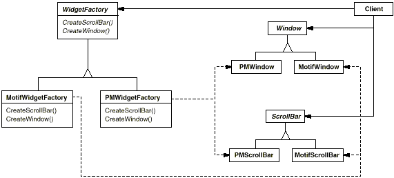
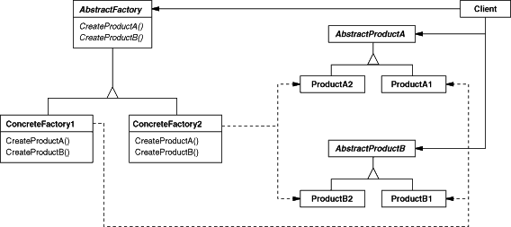

# 객체 생성(Object Creational): 추상 팩토리(ABSTRACT FACTORY)
## 의도
상세화된 서브클래스를 정의하지 않고도 서로 관련성이 있거나 독립적인 여러 객체의 군을 생성하기 위한 인터페이스를 제공합니다.
## 다른 이름
키트(Kit)
## 동기
모티프와 프레젠테이션 매니저와 같은 사용자 인터페이스 툴킷을 살펴보면, 서로 다른 룩앤필 표준을 가지고 있습니다. 서로 다른 룩앤필은 서로 다른 사용자 인터페이스의 표현 방식과 행동을 갖습니다. 스크롤바, 윈도우 버튼은 모양이 다르고 동작 방식도 서로 다릅니다. 개발한 응용프로그램이 서로 다른 룩앤필 표준에 상관없이 이식성을 가지려면, 응용프로그램이 각 사용자 인터페이스 툴킷에서 제공하는 위젲을 직접 사용하지 못하도록 해야 합니다.

이런 문제는 구체적 사용자 인터페이스의 위젯을 사용하지 말고 추상 클래스인 `WidgetFactory`를 정의하여 해결하는 게 좋습니다. `WidgetFactory` 클래스는 위젯의 기본 사용자 인터페이스 요소(윈도우, 스크롤바, 버튼 등)을 생성할 수 있는 인터페이스를 정의합니다. 그리고 응용프로그램은 필요한 사용자 인터페이스 요소를 `WidgetFactory`에 생성해 줄 것을 요청하여, 필요한 요소의 인스턴스를 얻어옵니다. 물론, 실제적으로 구현 종속적인 인스턴스를 생성하기 위해서는 팩토리와 구분하여 각각의 위젯별로 추상화된 클래스를 정의해야 하고, 이를 상속하는 구체적인 서브클래스를 정의하여 구체적 룩앤필 표준에 대한 구현을 제공합니다.

예를 들어, `Window`라는 개념의 사용자 인터페이스가 있다면 인스턴스를 생성하는 팩토리와 구분하여 생성할 룩앤필의 표준에 대응하는 `Window` 클래스를 추상 클래스로 정의합니다. 그러고 나서 각 사용자 인터페이스 툴킷이 제공하는 위젯 및 구현 방식에 따라 `PMWindow`, `MotifWindow`를 정의합니다.

`WidgetFactory` 인터페이스는 각 추상화된 위젯 클래스의 인스턴스를 생성하여 반환하는 연산을 정의합니다. 사용자는 `WidgetFactory`에 원하는 요소의 인스턴스를 생성하는 연산을 호출하여 위젯의 인스턴스를 얻게 됩니다. 그러나 사용자는 `WidgetFactory`를 상속받은 어떤 구체적 서브클래스가 이들 연산을 구현하여 결과를 반환하는지 알 수 없고, 알 필요도 없습니다. 즉, 사용자는 팩토리에만 메시지를 보낼 뿐이지, `PMWindow`에 메시지를 보내는지, `MotifWindow`에 보내는지는 알 필요가 없습니다. 이로써 사용자는 룩앤필과 분리될 수 있습니다.

이 패턴을 사용하기 위해서는 `AbstractFactory`에 해당하는 `WidgetFactory`뿐만 아니라 각 룩앤필 표준에 대한 `WidgetFactory`를 상속받는 구체 서브클래스들을 정의해야 합니다. 

위 그림에 정의된 모델을 보면 `WidgetFactory` 및 이 클래스의 서브클래스들과 이들이 생성하는 위젯 클래스 간의 모델이 표현되어 있습니다. `WidgetFactory`를 상속받은 서브클래스들인 `MotifWidgetFactory`와 `PMWidgetFactory`가 구체적 룩앤필에 정의된 실제 위젯을 생성하는 연산을 구현합니다. 즉, `MotifWidgetFactory`에 정의된 `CreateScrollBar` 연산은 모티프의 스크롤바를 반환하고, `PMWidgetFactory`에 있는 해당 연산은 프레젠테이션 매니저에 필요한 스크롤바를 생성해서 반환합니다. 그러나 사용자는 이런 내부 처리와 상관없이, `WidgetFactory` 인터페이스를 통해서만 추상화된 위젯을 생성합니다.

`WidgetFactory`를 사용하면 구체 위젯 클래스 사이에 의존 관계가 만들어집니다. 모티프의 스크롤바는 모티프 버튼 및 모티프 텍스트 편집기와 함께 사용되어야 하는 것이죠. `MotifWidgetFactory`를 쓴 결과로 자동으로 생긴 제약입니다.
## 활용성
추상 팩토리는 다음의 경우에 사용합니다.
- 객체가 생성되거나 구성,표현되는 방식과 무관하게 시스템을 독립적으로 만들고자 할 때
- 여러 제품군 중 하나를 선택해서 시스템을 설정해야 하고 한번 구성한 제품을 다른 것으로 대체할 수 있을 때
- 관련된 제품 객체들이 함께 사용되도록 설계되었고, 이 부분에 대한 제약이 외부에도 지켜지도록 하고 싶을 때
- 제품에 대한 클래스 라이브러리를 제공하고, 그들의 구현이 아닌 인터페이스를 노출시키고 싶을 때
## 구조

## 참여자
- **AbstractFactory**(WidgetFactory): 개념적 제품에 대한 객체를 생성하는 연산으로 인터페이스를 정의합니다.
- **ConcreteFactory**(MotifFactory, PMFactory): 구체적인 제품에 대한 객체를 생성하는 연산을 구현합니다.
- **AbstractProduct**(Window, ScrollBar): 개념적 제품 객체에 대한 인터페이스를 정의합니다.
- **ConcreteProduct**(MotifWindow, MotifScrollBar): 구체적으로 팩토리가 생성할 객체를 정의하고, **AbstractProdcut**가 정의하는 인터페이스를 구현합니다.
- **Client**: `AbstractFactory`와 `AbstractProdcut` 클래스에 선언된 인터페이스를 사용합니다.
## 협력 방법
- 일반적으로 `ConcreteFactory` 클래스의 인스턴스 한 개가 런타임에 만들어집니다. 이 구체 팩토리(concrete factory)는 어떤 특정 구현을 갖는 제품 객체를 생성합니다. 서로 다른 제품 객체를 생성하려면 사용자는 서로 다른 구체 팩토리를 사용해야 합니다.
- `AbstractFactory`는 필요한 제품 객체를 생성하는 책임을 `ConcreteFactory` 서브클래스에 위임합니다.
## 결과
추상 팩토리 패턴을 쓰면서 얻는 이익과 부담은 다음과 같습니다.
1. **구체적인 클래스를 분리합니다.** 추상 팩토리 패턴을 쓰면 응용프로그램이 생성할 객체의 클래스를 제어할 수 있습니다. 팩토리는 제품 객체를 생성하는 과정과 책임을 캡슐화한 것이기 때문에, 구체적인 구현 클래스가 사용자에게서 분리됩니다. 일반 프로그램은 추상 인터페이스를 통해서만 인스턴스를 조작합니다. 제품 클래스 이름이 구체 팩토리의 구현에서 분리되므로, 사용자 코드에는 나타나지 않는 것입니다.
2. **제품군을 쉽게 대체할 수 있도록 합니다.** 구체 팩토리의 클래스는 응용프로그램에서 한 번만 나타나기 때문에 응용프로그램이 사용할 구체 팩토리를 변경하기는 쉽습니다. 또한, 구체 팩토리를 변경함으로써 응용프로그램은 서로 다른 제품을 사용할 수 있게 변경됩니다. 추상 팩토리는 필요한 모든 것을 생성하기 때문에 전체 제품군은 한번에 변경이 가능합니다. 앞에서 보신 사용자 인터페이스 예제에서 Motif 위젯을 PM 위젯으로 쉽게 변경할 수 있었는데, 이는 대응하는 팩토리를 교체하고 이 인터페이스를 다시 만들어서 해결한 것입니다.
3. **제품 사이의 일관성을 증진시킵니다.** 하나의 군 안에 속한 제품 객체들이 함께 동작하도록 설계되어 있을 때, 응용프로그램은 한 번에 오직 한 군에서 만든 객체를 사용하도록 함으로써 프로그램의 일관성을 갖도록 해야 합니다. 추상 팩토리를 쓰면 이 점을 아주 쉽게 보장할 수 있습니다.
4. **새로운 종류의 제품을 제공하기 어렵습니다.** 새로운 종류의 제품을 만들기 위해 기존 추상 팩토리를 확장하기가 쉽지 않습니다. 생성되는 제품은 추상 팩토리가 생성할 수 있는 제품 집합에만 고정되어 있기 때문입니다. 만약 새로운 종류의 제품이 등장하면 팩토리의 구현을 변경해야 합니다. 이는 추상 팩토리와 모든 서브클래스의 변경을 가져옵니다. 즉, 인터페이스가 변경되는 새로운 제품을 생성하는 연산이 추가되거나, 기존 연산의 반환 객체 타입이 변경되었으므로, 이를 상속받는 서브클래스 모두 변경되어야 합니다.
## 구현
추상 팩토리 패턴을 구현하는 기법은 여러 가지입니다. 아래에 몇 가지를 정리했습니다.
### 1. 팩토리를 단일체로 정의합니다.

전형적으로 응용프로그램은 한 제품군에 대해서 하나의 `ConcreteFactory` 인스턴스만 있으면 됩니다. 즉, 갖가지 제품의 종류를 만들어 내는 팩토리는 제품군에 대해서 하나면 되는 것입니다. 그러므로 단일체로 구현하는 것이 바람직합니다. 이 단일체 역시 생성 패턴의 한 종류입니다. 다음에 좀 더 상세히 다루기로 합니다.

### 2. 제품을 생성합니다.

`AbstractFactory`는 단지 제품을 생성하기 위한 **인터페이스**를 선언하는 것이고, 그것을 생성하는 책임은 `Product`의 서브클래스인 `ConcreteProduct`에 있습니다. 이를 위한 가장 공통적인 방법은 각 제품을 위해서 팩토리 메서드를 정의하는 것입니다. `AbstractFactory`는 각 제품 생성을 위한 팩토리 메서드를 재정의(overriding)함으로써 각 제품의 인스턴스를 만듭니다. 이 구현은 간단하지만, 제품군이 약간 다르다면 각 제품군을 위한 새로운 구체팩토리 서브클래스가 필요합니다. 

많은 제품군이 가능하다면 구체 팩토리는 원형 패턴을 이용해서 구현할 수 있습니다. 구체 팩토리가 한 군내의 각 제품 원형 인스턴스로 초기화되고 원형의 복사를 통해서 인스턴스를 생성합니다. 원형 기반의 접근법은 새로운 제품군별로 새로운 구체 팩토리를 생성할 필요를 없애줍니다.

원형 기반의 팩토리를 스몰토크로 구현해 봅시다. 구체 팩토리는 `partCatalog`라는 디렉터리에 복사되어 원형을 저장합니다. `make:` 메서드는 원형을 검색해서 복사합니다. 
```c++
  make: partName
    ^ (partCatalog at: partName) copy
```
구체 팩토리는 카탈로그에 부분(part)을 추가하는 메서드를 갖습니다.
```c++
  addPart: partTemplate named: partName
    partCatalog at: partName put: partTemplate
```
기호 `:`로 원형을 식별해서 팩토리에 원형을 추가합니다.
```c++
  aFactory addPart: aPrototype named: #ACMEWidget
```
이와 같은 원형 기반 방법은 클래스를 1급(first-class) 객체로 다루는 언어(스몰토크, Objective C)를 사용할 때 다양하게 변형시킬 수 있습니다. 이 언어에서 정의하는 클래스는 제품의 한 종류만을 생성하는 팩토리로 볼 수 있습니다. **클래스**를 특정 팩토리 안에 저장하여 다양한 특정 제품을 생성할 수 있도록 하는 것입니다. 이 클래스들은 특정 팩토리를 대신해서 새 인스턴스를 생성합니다. 새로운 팩토리는 서브클래싱보다는 팩토리의 인스턴스 초기화를 통해서 새로운 팩토리를 정의합니다. 이것은 언어의 특징을 살릴 수 있는 방법입니다. 반면에 순수한 원형 기반 방법은 언어에 독립적입니다.

방금 말씀드린 스몰토크 언어의 원형 기반 팩토리처럼, 클래스 기반의 버전에는 `partCatalog` 인스턴스 변수가 하나 있는데, 이 변수는 부품(part)의 이름을 키(key)로 하는 사전입니다. 복제된 원형을 저장하는 대신 `partCatalog` 변수는 제품에 대한 클래스를 저장합니다. `make:` 메서드는 다음과 같이 정의할 수 있습니다.
```c++
  make: partName
    ^ (partCatalog at: partName) new
```
### 3. 확장 가능한 팩토리들을 정의합니다.
`AbstractFactory`에는 생성할 각 제품의 종류별로 서로 다른 연산(`CreateProductA()`, `CreateProductB()`)을 정의합니다. 이 제품들의 종류는 연산의 시그너처를 보면 알 수 있습니다. `CreateProductA()`를 통해 `ProductA`를 만듭니다. 새로운 종류의 제품이 추가되면 `AbstractFactory`의 인터페이스에도 새로운 연산을 추가해야 합니다. 좀 더 유연하게 하려면 생성할 객체를 매개변수로 만들어 연산에 넘기면 됩니다. 그리고 매개변수에다가 생성할 객체의 종류를 표현합니다. 이렇게 되면 `AbstractFactory`에는 `Make()` 연산만 있으면 되고, `Make()` 연산의 매개변수로 생성할 제품에 대한 식별자를 넘겨주게 됩니다. 이것은 앞에서 설명한 원형 및 클래스에 기반을 둔 추상 팩토리에서 쓴 기법이죠.

이 변형 기법은 C++ 같은 정적 타입 언어보다는 스몰토크와 같은 동적 타입 언어에서 더 쉽게 사용할 수 있습니다. C++를 사용할 수 있는 경우는 모든 객체들이 같은 추상 클래스를 갖고 있거나 제품 객체가 이들을 요청하는 사용자에 의해 정확한 타입으로 강제 변환할 수 있을 때만입니다. 팩토리 메서드 패턴의 '구현'절을 보면 C++를 이용해서 매개변수화된 연산으로 구현하는 방법을 보실 수 있습니다.

강제 변환이 필요 없어졌다 하더라도 여전히 태생적 문제는 남아있습니다. 모든 제품 객체가 사용자 쪽에 반환될 때 반환 타입으로 주어진 것과 동일한 추상 인터페이스를 만족해야 한다는 것입니다. 사용자는 반환 값으로 이들을 서로 구별할 수 없고, 제품의 클래스에 대한 적절한 가정도 할 수 없습니다. 서브클래스에 국한된 연산의 수행이 필요하다면 추상 클래스를 통해서는 접근할 수 없습니다. C++에 정의된 `dynamic_cast` 같은 타입 변환을 수행할 수 있다고 하더라도 항상 안전한 타입 변환이 되는 것은 아닙니다. 이것은 유연한 인터페이스와 확장 가능한 인터페이스 간의 선택사항입니다.