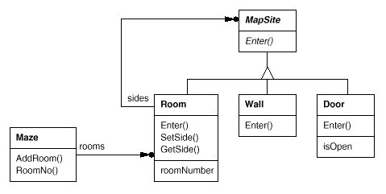

# Chapter 3 생성 패턴
생성 패턴(creational pattern)은 인스턴스를 만드는 절차를 추상화하는 패턴입니다. 이 범주에 해당하는 패턴은 객체를 생성,합성하는 방법이나 객체의 표현 방법과 (소프트웨어) 시스템을 분리해 줍니다. 클래스 생성 패턴이 인스턴스로 만들 클래스를 다양하게 만들기 위한 용도로 상속을 사용하는 반면, 객체 생성 패턴은 인스턴스화 작업을 다른 객체에게 떠넘길 수도 있습니다.

생성 패턴은 시스템이 상속보다는 복합 방법을 사용하는 쪽으로 진화되어 가면서 더 중요해지고 있습니다. 이 때문에 고정된 행동 집합을 정의하는 것보다는, 더 복잡한 행동을 만드는 데 필요한 구성요소가 될 수 있는 기본적인 행동 집합을 정의하는 쪽에 더 많은 관심과 노력이 들어가고 있습니다. 그러므로 특정 행동을 수행하는 클래스를 만들려면 단순하게 하나의 클래스를 인스턴스화하는 일 이상의 품이 들어갑니다.

생성 패턴이 나오면 항상 따라다니는 이야기가 두 개 있습니다.
1. 생성 패턴은 시스템이 어떤 구체 클래스를 사용하는지에 대한 정보를 캡슐화합니다.
2. 생성 패턴은 이들 클래스의 인스턴스들이 어떻게 만들고 어떻게 서로 맞붙는지에 대한 부분을 완전히 가려줍니다.

결론적으로, 생성 패턴을 이용하면 **무엇이** 생성되고, **누가** 이것을 생성하며, 이것이 **어떻게** 생성되는지, **언제** 생성할 것인지 결정하는 데 유연성을 확보할 수 있게 됩니다.

생성 패턴으로 분류되는 패턴은 여러 개인데, 이런 여러 생성 패턴들은 서로 보완적일 수도 있고 선택되기 위해 서로 경쟁적일 수도 있습니다. 즉, 동일한 문제 해결을 위해서 어떤 생성 패턴을 새용해야 할지 결정을 내리기가 어렵습니다.

인스턴스를 생성하고 복합하는 방법에 해당하는 부분과 이들 인스턴스를 사용하는 프로그램을 분리하고자 할 때 어떤 패턴을 적용해야 하는지 판단하기는 어렵습니다. 예를 들어, 원현 패턴과 추상 팩토리 패턴 중 무엇을 선택할지 고민해야 할 때가 있습니다. 어떨 때는 또 이들이 서로 보완적일 수도 있지요. 예를 들어, 빌더 패턴은 어떤 구성요소를 만들지 구현하는 데에 다른 생성 패턴 중 하나를 사용할 수 있습니다. 원형 패턴은 자기 자신의 구현을 위해 단일체 패턴을 사용하기도 합니다.

생성 패턴 간에는 매우 밀접한 관련성이 있기 때문에, 이들 간의 공통점과 차이점을 중심으로 다섯 개의 패턴을 공부하기로 하겠습니다. 그리고 하나의 예제를 통해 각 패턴의 설명을 진행할까 합니다. 바로 컴퓨터 게임에 넣을 미로를 만드는 문제입니다. 패턴에 따라 미로와 게임이 어떻게 조금씩 다르게 만들어지는지 잘 보시기 바랍니다. 단순히 미로에서 빠져나오는 게임일 때는 전체 미로 중 플레이어에게 보이는 만큼의 미로가 표시될 것입니다. 풀어야 할 문제가 있을 수도 있고, 극복해야 할 위험이 숨겨진 미로 게임일 때는 미로의 일부분에 해당하는 평면 지도가 제공되기도 합니다.

여기서는 복잡한 미로 게임을 다루지는 않을 것이며, 또 혼자 하는 게임인지 여러 사람이 하는 게임인지도 구분하지 않을 것입니다. 그보다는 미로를 어떻게 만들 것인가를 강조할 것입니다. 미로는 방들의 집합이고, 각 방은 옆에 무엇이 있는지 알고 있는데, 방 옆에 있는 것이 방일 수도 있고, 문일 수도 있고, 벽일 수도 있는 것입니다.

클래스 `Room`, `Door`, `Wall`은 우리가 개발하는 미로를 만드는 데 필요한 구성요소입니다. 이 요소에 대해서도 미로를 생성하는 데 중요한 클래스만 정의하겠습니다. 게임하는 사람, 미로 내에서 돌아다니는 방법, 화면에 디스플레이하는 방법, 또는 미로 구축과 상관없는 복잡한 내용들은 다루지 않을 것입니다.

다음 클래스 다이어그램은 클래스 간의 관련성을 보여줍니다.

각 방은 네 개의 방향을 갖는데, C++ 구현 시에는 나열자 타입으로 정의한 `Direction`을 사용하여 각 방향을 다음과 같이 선언합니다.
```c++
enum Direction {North, South, East, West};
```
스몰토크로 구현할 때도 역시, 각 방향을 나타내는 기호를 사용합니다.

`MapSite` 클래스는 미로의 구성요소들에 필요한 모든 연산을 정의한 공통 추상 클래스입니다. 예를 단순하게 하기 위해서 `MapSite`는 `Enter()` 연산 하나만을 정의하도록 합니다. `Enter()` 메서드는 무엇에 들어가느냐에 따라 그 의미가 달라질 것입니다. 즉, 방에 들어간다면 위치가 바뀌도록 구현해야 할 것입니다. 들어가는 것이 문이라면 이렇게 구현합니다. 문이 열려있으면 문을 통해 다른 방으로 들어가도록 구현하고, 문이 닫혀 있다면 상처를 입도록 구현하면 됩니다.
```c++
class MapSite {
  public:
    virtual void Enter() = 0; // 구현부를 갖지 않는 순수 가상 메서드
}
```
`MapSite`에 정의된 `Enter()`는 좀 더 섬세한 게임 동작을 만드는 데 쓸 수 있는 기본 연산입니다. 만약, 방에 있을 때 "동쪽으로 가시오"라고 구현하고 싶으면, 게임은 어떤 `MapSite`가 동쪽에 인접한 것인지 판단한 후 그 대상에 정의된 `Enter()`를 호출하도록 메서드를 구현합니다. `MapSite`의 서브클래스가 어떤 것이냐에 따라 `Enter()`는 위치를 변경하도록 구현할 수도 있고, 이동을 못하고 상처를 입도록 구현할 수도 있습니다.

`Room` 클래스는 `MapSite`를 상속받은 구체적인 클래스로 미로에 있는 다른 요소와 관련성을 갖도록 정의합니다. 다른 요소들 어느 것과도 관련성을 가질 수 있으므로 `Room`은 다른 요소들의 부모 클래스인 `MapSite`와 연결 관계를 갖는 것으로 모델링합니다. `Room` 클래스는 방 번호를 저장하는데, 이 번호로 미로에 있는 방을 식별할 수 있습니다.
```c++
class Room : public MapSite {
  public:
    Room(int RoomNo);

    MapSite* GetSide(Direction) const;
    void SetSide(Direction, MapSite*);

    virtual void Enter();
  private:
    // 방은 네 개의 방향을 갖고 있고
    // 각 방향에는 MapSite의 서브클래스 인스턴스가 올 수 있습니다.
    MapSite* _sides[4];
    int _roomNumber;
}
```
다음 클래스는 방의 각 측면에 있을 수 있는 문과 벽을 보여줍니다.
```c++
class Wall : public MapSite {
  public:
    Wall();
    virtual void Enter();
}

class Door : public MapSite {
  public:
    Door(Room* = 0, Room* = 0);
    // 문을 초기화하기 위해서는 문이 어느 방 사이에 있는지 알아햐 합니다.
    virtual void Enter();
    Room* OtherSideFrom(Room*);
  private:
    Room* _room1;
    Room* _room2;
    bool _isOpen;
}
```
미로를 복합하는 요소에 대해서는 좀 더 살펴봐야 합니다. 또한 방들의 집합을 표현하기 위해 클래스 `Maze`를 정의하겠습니다. `Maze`는 `RoomNo()` 연산의 힘을 빌어서 방 번호가 주어진 특정 방을 찾을 수도 있습니다.
```c++
class Maze {
  public:
    Maze();

    void AddRoom(Room*);
    Room* RoomNo(int) const;
  private:
    // ...
}
```
`RoomNo()` 연산은 선형 탐색이나 해시 테이블 또는 단순 배열을 통해서 구현할 수 있습니다. 그러나 이 책에서 이런 부분은 별로 중요하지 않으므로 다루지 않을 것이고, 그 대신 미로 객체의 구성요소를 어떻게 설정하느냐에 집중하려고 합니다.

다른 필요한 클래스로는 `MazeGame`이 있습니다. 실제로 미로를 생성하는 클래스입니다. 미로를 생성하는 가장 간단하고 일반적인 방법은 일련의 연산을 통해 빈 미로에 미로의 구성요소를 추가하고 이들을 연결하는 것 입니다. 예를 들어, 다음에서 멤버 함수 `CreateMaze()`는 방 사이에 문이 있는 두 개의 방으로 구성된 미로를 만듭니다.
```c++
Maze* MazeGame::CreateMaze () {
  Maze* aMaze = new Maze;
  Room* r1 = new Room(1);
  Room* r2 = new Room(2);
  Door* theDoor = new Door(r1, r2);

  aMaze->AddRoom(r1);
  aMaze->AddRoom(r2);

  r1->SetSide(North, new Wall);
  r1->SetSide(East, theDoor);
  r1->SetSide(South, new Wall);
  r1->SetSide(West, new Wall);

  r2->SetSide(North, new Wall);
  r2->SetSide(East, new Wall);
  r2->SetSide(South, new Wall);
  r2->SetSide(West, theDoor);

  return aMaze;
}
```
즉, 일련의 연산을 통해 방을 만들고 방 사이에 문을 다는 것입니다. 이 함수는 약간 복잡해 보이긴 합니다. 겨우 방 두 개를 만든 것 뿐인데 말이죠. 좀 더 간단한 구현 방법이 분명히 있을 수 있습니다. 예를 들어, `Room` 클래스의 생성자에서 모든 방향의 면(slide)들을 벽(wall)으로 초기화해두었다면 방의 모든 면을 세팅하는 코드는 `CreateMaze()`에서 없앨 수 있습니다.
```diff
Maze* MazeGame::CreateMaze () {
  Maze* aMaze = new Maze;
  Room* r1 = new Room(1);
  Room* r2 = new Room(2);
  Door* theDoor = new Door(r1, r2);

  aMaze->AddRoom(r1);
  aMaze->AddRoom(r2);

- r1->SetSide(North, new Wall);
  r1->SetSide(East, theDoor);
- r1->SetSide(South, new Wall);
- r1->SetSide(West, new Wall);

- r2->SetSide(North, new Wall);
- r2->SetSide(East, new Wall);
- r2->SetSide(South, new Wall);
  r2->SetSide(West, theDoor);

  return aMaze;
}
```
즉, 위와 같은 코드는 필요없게 됩니다. 다시 말해, `Room` 클래스의 생성자에서 이런 일은 처리하고 단지 다음과 같이 변경되는 부분만 코드화하면 됩니다.

그러나 앞의 `CreateMaze()` 코드가 가지고 있는 진짜 문제는 코드의 라인 수가 많다는 것이 아니고 코드의 **유연성이 떨어진다**는 것입니다. 여기서는 방의 레이아웃이 하드코딩되어 있습니다. 즉, 레이아웃을 바꾸고 싶으면 멤버 함수를 바꾸는 수밖에 없습니다. 이 함수를 오버라이드하든지(전체를 재구현하는 거죠) 이 함수으 일부를 바꾸든지(오류 가능성이 높은데다가 재사용성에 도움이 안되는 일입니다) 말이죠.

생성 패턴은 이런 상황에서 어떻게 **유연한** 설계를 할 수 있는지에 대한 해법을 제공합니다. 특히 미로의 구성요소를 정의하는 클래스를 쉽게 변경할 수 있는 방법을 제공합니다.

기존 미로가 갖고 있는 레이아웃을 재사용하면서 마법 주문이 걸린 미로가 있는 게임을 만들고 싶다고 가정해 봅시다. 이 마법의 미로 게임을 만들기 위해서는 단어를 맞추면 문이 열리는 `DoorNeedingSpell`이라든지, 마법 키나 단어 등 특별한 항목을 포함하는 `EnchantedRoom`과 같은 새로운 구성요소가 필요합니다. 어떻게 하면 `CreateMaze()` 함수를 쉽게 바꿔 이런 것들이 달린 미로를 만들 수 있을까요?

지금 시점에서 가장 큰 장애 요인은 클래스들의 인스턴스를 직접 생성하도록 하드 코딩한다는 점입니다. 생성 패턴은 이런 어려움을 이길 수 있는 여러가지 방법을 제공합니다.

- `CreateMaze`가 방, 벽, 문을 생성하기 위해서 생성자를 이용하지 않고 가상 함수를 호출하도록 구현되어 있다면, 이 가상 함수의 실제 구현을 다양한 방법으로 변경할 수 있을 것입니다. 이 방법은 [팩토리 메서드(Factory Method)](https://github.com/wonder13662/my-books/blob/writing/GOF-design-patterns/Chapter02/3-1.md) 패턴의 한 예입니다.
- `CreateMaze`가 방, 벽, 문을 생성하기 위해 생성 방법을 알고 있는 객체를 매개변수로 넘겨 받을 수 있다면, 생성 방법이 바뀔 때마다 새로운 매개변수를 넘겨받음으로써 생성할 객체의 유형을 달리할 수 있습니다. 이는 [추상 팩토리(Abstract Factory)](https://github.com/wonder13662/my-books/blob/writing/GOF-design-patterns/Chapter02/3-2.md) 패턴의 한 예입니다.
- `CreateMaze`가 생성하고자 하는 미로에 방, 문, 벽을 추가하는 연산을 사용해서 새로운 미로를 만들 수 있는 객체를 넘겨받는다면 미로를 만드는 방법이나 변경을 이 객체의 상속을 통해서 해결할 수 있습니다. 이는 [빌더(Builder)](https://github.com/wonder13662/my-books/blob/writing/GOF-design-patterns/Chapter02/3-3.md) 패턴의 예입니다.
- `CreateMaze`가 이미 만든 다양한 방, 문, 벽 객체로 매개변수화하는 방법도 가능한데, 이미 만든 객체를 복사해서 미로에 추가하면, 이들 인스턴스를 교체하여 미로의 복합 방법을 변경할 수 있습니다. 이는 [원형(Prototype)](https://github.com/wonder13662/my-books/blob/writing/GOF-design-patterns/Chapter02/3-4.md) 패턴의 예입니다.

다섯 개 생성 패턴 중에서 위에 쓰지 않은 [단일체(Singleton)](https://github.com/wonder13662/my-books/blob/writing/GOF-design-patterns/Chapter02/3-5.md) 패턴이란 것이 있습니다. 이 패턴은 한 게임에 오로지 하나의 미로 객체만 존재할 수 있고 그 게임에서 돌아가는 모든 게임 객체들이 이 미로에 접근이 가능하도록 보장합니다. 전역 변수나 전역 함수에 의존할 필요 없이 이런 일이 가능합니다. 또한 단일체 패턴은 기존 코드를 건드리지 않고도 미로를 쉽게 대체하거나 확장할 수 있도록 해 줍니다.